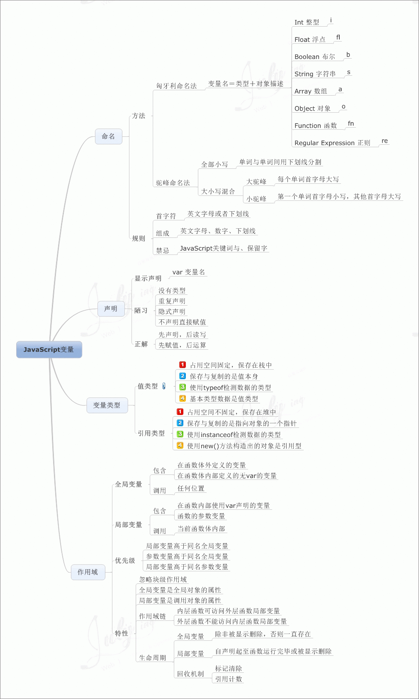

# 第三章：JavaScript 行为

## 第一节：JavaScript 入门

> JavaScript 内嵌于 HTML 网页中，通过浏览器内置的 JavaScript 引擎直接编译，把一个原本只用来显示的页面，转变成支持用户交互的页面程序

### 3.1.1 JavaScript 介绍

#### JavaScript 脚本语言

> JavaScript 是一种脚本（Script）语言，简单来说就是一条条的文本命令
>
> 非脚本语言一般 需要编译、链接、生成独立的可执行文件后才能运行；而脚本语言缩短了传统语言 "编写 - 编译 - 链接 - 运行" 的过程

#### JavaScript 的跨平台性

> JavaScript 语言不依赖操作系统，仅需要浏览器的支持，几乎所有的浏览器都支持 JavaScript

#### JavaScript 支持面向对象

> 面向对象是软件开发中一种重要的编程思想，优点非常之多。如：基于面向对象思想诞生了许多优秀的库和框架，可使 JavaScript 开发变得快捷高效，降低了开发成本。
>
> 除了经典的 JavaScript 库 JQuery，还有 Bootstrap、AngularJS、Vue.js、Backbone.js、React、webpack 等框架和工具

### 3.1.2 开发工具

> JavaScript 的开发工具主要包括浏览器和代码编辑器两种软件。浏览器用于执行、调试 JavaScript 代码，代码编辑器用于编写代码

#### 排版引擎

1. **Trident**

   > Trident 是 Internet Explorer（IE）浏览器使用的引擎

2. **EdgeHTML**

   >EdgeHTML 是 Microsoft Edge 浏览器使用的引擎

3. **Gecko**

   > Mozilla FireFox（火狐浏览器）使用的引擎

4. **Webkit**

   > 开源的浏览器引擎，包含WebCore 排版引擎和 JavaScriptCore 引擎来自于 KDE 项目组的 KHTML 和 KJS

5. **Blink**

   > Google 公司 和 Opera Software ASA 开发的浏览器排版引擎

#### JavaScript 引擎

1. **Chakra**

   > IE 9~11 中使用的 JavaScript 引擎

2. **SpiderMonkey**

   > Mozilla 项目中的一个 JavaScript 引擎

3. **Rhino**

   > Mozilla 项目中的一个使用 Java 语言编写的 JavaScript 引擎

4. **JavaScriptCore**

   > 苹果在 Safari 浏览器中使用的 JavaScript 引擎

5. **V8**

   > Google 为 Chrome 浏览器开发的 JavaScript 引擎，具有较快的执行速度。Node.js 也整合了 V8 引擎


#### 代码编辑器

1. **Notepad++**

   > 一款在 Windows 环境下免费开源的代码编辑器

2. **Sublime Text 3**

   > 轻量级的代码编辑器，友好的用户界面，还可以用过灵活的插件机制扩展编辑器的功能，可以利用 Python 开发

3. **NetBeans**

   > 由 Sun 公司建立的开放源代码的软件开发工具，，是一个可扩展的开发平台。
   >
   > NetBeans 开发环境可提供代码编写、调试、跟踪、语法高亮、语法检查、格式化代码风格等功能

4. **HBuilder**

   > 由 DCloud（数字天堂）推出的一款支持 HTML5 的 Web 开发编辑器

5. **Adobe Dreamweaver**

   > 集网页制作和网站管理于一身的所见即所得网页编辑器

6. **WebStorm**

   > JetBrains 公司推出的一款 Web 前端咖啡啊工具，JavaScript、HTML5 开发是其强项，支持许多流行的前端技术


### 3.1.3 JavaScript 引入方式

#### 嵌入式

> 使用 script 标签包裹 JavaScript 代码，直接编写到 HTML 文件中

```HTML
<html>
    <head>
        <script> JavaScript代码 </script>
    </head>
    <body>
    	网页内容
    </body>
</html>
```


#### 外链式

> 将 JavaScript 代码保存到一个单独的文件中，通常使用 js 作为文件拓展名，然后使用 `<script>` 标签的 src 属性引入文件
>
> **外链式有利于分布式部署，网页中链接的 js、css、图片 等静态文件可以部署到 CDN 服务器上，利用 CDN 的优势加快下载速度**

```html
<html>
    <head>
        <script src="js/text.js"> </script>
    </head>
    <body>
    	网页内容
    </body>
</html>
```


#### 行内式

> 将 JavaScript 代码作为 HTML 标签的属性值使用

```html
<a href="Javascript: alert('htllo');"> test </a>
```


**注意：**在引入 JavaScript 代码时，无论使用内嵌式还是外链式，页面的下载和渲染都会暂停，等待脚本执行完成后才会继续。

​	对于外链式，由于页面加载脚本文件会阻塞其他资料的下载，因此对于不需要提前执行的代码，将 script 标签放在 body 标签的底部，可以减少对整个页面下载的影响


### 3.1.4 JavaScript 阻塞问题

> 为了降低 JavaScript 阻塞问题对页面造成的影响，可以使用 HTML5 为 `<script>` 标签新增的两个可选属性：async 和 defer
>
> **`添加 async 或 defer 属性后，即使文件下载失败，也不会阻塞后面的 JavaScript 代码执行`**

1. **async**

   > 用于异步加载，即先下载文件，不阻塞其他代码执行，下载完成后再执行

2. **defer**

   > 用于延后执行，即先下载文件，直到网页加载完成后再执行


### 3.1.5 常用的输出语句

#### alert()

> 用于弹出一个警告框

```html
alert('警告框');
```

#### console.log()

> 用于在浏览器的控制台中输出内容

```html
console.log('控制台输出');
```

#### confirm.log()

> 确认弹窗。

```js
confirm.log('是否确认');
```

#### prompt()

> 提示用户输入框。

```js
prompt('请输入年龄');
```

#### document.write()

> 用于在 HTML 文档页面中输出内容

```html
<html>
    <head>
        <script> document.write('这是加粗文本'); </script>
    </head>
    <body>
    	<script> document.write('这是拓展文本'); </script>
    </body>
</html>


效果： 这是加粗文本这是拓展文本
```


### 3.1.6 注释

#### 单行注释 //

```javascript
// 单行注释
```


#### 多行注释 /**/

```javascript
/*
	多行注释
	多行注释
*/
```


### 3.1.7 函数

> 将一些常用的功能模块编写成函数，通过调用来实现，可以简化，方便阅读
>
> 函数执行后可以返回一个表示结果的值

```javascript
自定义函数

// 定义函数
function sum(a,b) {
    var c = a + b;
    return c;
}

// 调用函数
alert(sum(11,22));		// 结果为：33
```


### 3.1.8 对象

> 一个对象的成员由属性和方法组成
>
> - 属性就是一些变量，用来保存部门名称
> - 方法就行一些函数，用来保存部门的各种工作任务

#### Windows 对象

> Windows 对象是 JavaScript 与浏览器之间交互的主要接入点
>
> **window 后面的 " . " 用于访问对象的属性和方法，两者通过有无小括号来区分，有小括号表示可以作为方法进行调用**

```javascript
Windows 对象的属性

window.console;			// 访问 window对象 的 console 属性
window.document;		// 访问 window对象 的 document 属性
window.alert('test');	// 调用 window对象 的 alert() 方法
window.prompt('test');	// 调用 window对象 的 prompt() 方法
```


#### document 对象

> document 对象是 window 对象的属性之一，主要用于与网页文档进行交互
>
> **当通过 JavaScript 访问或者修改网页中的某个元素时，需要先利用 document 对象提供的方法，根据元素的标签名（如：div、span 等）或元素的属性（如：id、class、name）来获取一个元素对象，然后再使用这个对象的属性、方法来进行操作**

```html
<body>
    <div id="test"> hello </div>
    
    <script>
    	var test = document.getElementById('test');		// 根据元素id 获取元素对象
        alert(test.innerHTML);		// 通过 innerHTML 属性获取元素内容，输出结果为 hello
    </script>
</body>
```


#### String 对象

> String 对象在 JavaScript 中几乎无处不在，在代码中直接定义的字符串，就可以作为对象来使用，一个对象包含了多个属性和方法，用来获取信息或进行处理

```javascript
var str = 'apple';
alert(str.length);				// 获取字符串的长度
alert(str.toUpperCase());		// 获取转换大写后的结果：APPLE
alert('aa'.toUpperCase());		// 直接调用字符串的成员方法：AA
```


#### 自定义对象

```javascript
// 创建空对象
var stu = {};
// 添加属性
stu.name = '小明';
stu.gender = '男';
stu.age = 18;
// 访问属性
alert(stu.name);		//访问属性，输出结果为：小明
// 添加方法
stu.introduce = function() {
    return '我叫' + this.name + '，今年' + this.age + '岁';
}
// 调用方法
alert(stu.introduce());		// 调用方法，输出结果为：我叫小明，今年18岁
```


### 3.1.9 事件

> 事件指可以被 JavaScript 侦测到的交互行为，如：在网页中滑动、点击鼠标、滚动屏幕、敲击键盘 等

```html
<input type="button" onclick="alert('hello');" value="test" />


实际开发写法

<body>
    <input id="btn" type="button" value="test" />
    
    <script>
    	document.getElementById('btn').onclick = function {
            alert(this.value);	// 获取按钮的 value 属性，输出结果为：test
        }
    </script>
</body>
```


### 案例1：改变网页背景色

```html
<html>
    <head>
        <script>
            // 定义一个color() 函数，函数参数 str 表示传入的颜色值
        	function color(str) {
                document.body.style.backgroundColor = str;
                // backgroundColor 表示 css 中的 background-color
            }
        </script>
    </head>
    <body>
        <input type="button" value="设为红色" onclick="color('red')" />
        <input type="button" value="设为蓝色" onclick="color('blue')" />
    </body>
</html>
```


### 案例2：验证用户输入的密码

```html
<script>
	var password = prompt('请输入密码：');
    if (password == "123456") {
        alert('密码输入正确');
    } else {
        alert('密码输入错误');
    }
</script>
```


---


## 第二节：JavaScript 基础语法

### 3.2.1 变量

#### 标识符

> 实际开发中，经常要自定义一些符号来标记一些名称，这些符号都被称为标识符
>
> 1. 由大小写字母、数字、下划线 和 美元符号($) 组成，如：str、arr3、$3
> 2. 不能以数字开头，如：34da 是非法标识符
> 3. 严格区分大小写，如：it 和 IT 表示两个不同的标识符
> 4. 不能使用 JavaScript 中的关键字命名，如：var 作为变量名是不合法的
> 5. 要尽量做到 "见起名知其意"，如 name 表示名字
>
> **注意：当标识符需要多个单词进行表示时，可以使用以下几种方法**
>
> - **下划线法（user_name）：通常应用于变量的命名**
> - **驼峰法（userName）：通常用于函数的命名**
> - **帕斯卡法（UserName）**


#### 保留关键字

JavaScript 保留字

| break    | do       | instanceof | typeof |
| -------- | -------- | ---------- | ------ |
| case     | else     | new        | var    |
| catch    | finally  | return     | void   |
| continue | for      | switch     | while  |
| debugger | function | this       | with   |
| default  | if       | throw      | delete |
| in       | try      | let*       | yield* |

JavaScript 关键字

|          |             |           |              |
| -------- | ----------- | --------- | ------------ |
| abstract | enum        | int       | short        |
| boolean  | export      | interface | static       |
| byte     | extends     | long      | super        |
| char     | final       | native    | synchronized |
| class    | float       | package   | throws       |
| const    | goto        | private   | transient    |
| debugger | implenments | protected | volatile     |
| double   | import      | public    |              |


#### 变量的使用

> 变量可以看做是存储数据的容器，变量的声明规则和标识符一样

```javascript
// 变量声明
var a = 10;

// 变量可以一次声明多个
var lastname="Doe", age=30, job="carpenter";
```



#### 常量的定义

> JavaScript 在ES6 中新增了 const 关键字，用于实现常量的定义，**习惯上常量名称总是使用大写字母表示**
>
> **常量一旦被赋值就不能改变，并且常量在声明时，必须为其指定某个值**

```javascript
const PI = 3.14;
const P = 2 * PI * r;
```


### 3.2.2 数据类型

>JavaScript 拥有动态类型。这意味着相同的变量可用作不同的类型：**字符串（String）、数字(Number)、布尔(Boolean)、数组(Array)、对象(Object)、空（Null）、未定义（Undefined）**

#### 原始数据类型(基本类型)

1. **字符串 String**

> 字符串是存储字符的变量，可以使用单引号或双引号

```javascript
var = "Hello";

字符串和数字拼接，数据类型仍为字符串
alert("hello" + 220);	// hello220

字符串和数字拼接，先计算括号内的结果，再进行拼接
alert("hello" + (220 + 120);	// hello340
```

2. **数值型 Number**

   > JavaScript 中的数值类型不区分整数和浮点数，所有数字都是数值型

   ```javascript
   var oct = 032;	// 八进制数表示的26
   var dec = 26;	// 十进制数表示的26
   var hex = 0x1a;	// 十六进制数表示的26
   
   var fnum1 = 3.14E3;		// 科学计数法格式 3.14*10³
   ```

   非数值 NaN

   > JavaScript 中的 NaN 是一个全局对象的属性，与数值型中的特殊值 NaN 一样，都表示非数字，可用于表示某个数据是否属于数值型
   >
   > 当 NaN 和 NaN 进行比较时，结果不一定是 true，这是因为 被操作的数据类型可能是布尔值、字符型、空值、未定义型 和 对象型中的任意一种类型

3. **布尔型 Boolean**

   > 布尔型是 JavaScript 中较常用的数据类型之一，通常用于逻辑判断，它只有 true 和 false 两个值，表示事物的 真 和 假

   ```javascript
   var flag1 = true;
   var flag2 = false;
   
   // 注意：JavaScript 中严格遵循大小写，因此，true 和 false 值只有全部为小写时才表示布尔型
   ```

   **转义符**

   | 转义符 |       说明        |
   | :----: | :---------------: |
   |  \\'   |      单引号       |
   |  \\"   |      双引号       |
   |  \\n   |     回车换行      |
   |  \\r   |       换行        |
   |  \\v   | 跳格（Tab、水平） |
   |  \\t   |      Tab符号      |
   |  \\f   |       换页        |
   |  \\\   |    反斜杠(\\)     |
   |   \b   |       退格        |
   |   \0   |     Null字节      |

4. **空值 Null**

   >只有一个特殊的 null 值，用于表示一个不存在的或无效的对象或地址，只有变量的值是小写的 null 时才会表示空值

5. **未定义型 Undefined**

   >未定义型 也只有一个特殊的 undefined 值，用于声明的变量还未被初始化时，变量的默认值为 undefined
   >
   >与 null 不同的是，unfinished 表示没有为变量设置值，而 null 则表示变量不存在或者无效
   >
   >注意：null 和 undefined 与 空字符串 和 0 都不相等


#### 引用数据类型

> 引用数据类型为 Object对象，后面详细介绍
>
> Object 对象分为用户自定义的对象 和 JavaScript 提供的内置对象


#### 数据类型检测

> JavaScript 中变量的数据类型不是开发人员设定的，而是根据该变量使用的上下文在运行时决定的

```javascript
var num1 = 12, num2 = "14", sum = 0;
sum = num1 + num2;			// 变量进行相加运算
console.log(sum);			// 输出结果为：1214
```

1. **typeof 操作符**

   >typeof 操作符 以字符串的形式，返回未经计算的操作数的类型

   ```javascript
   var num1 = 12, num2= "14";
   var sum = num1 + num2;
   
   console,log(typeof num1);	// number
   console.log(typeof.num2);	// string
   console.logo(typeof.sum);	// string
   ```

2. **对象原型的扩展函数**

   > JavaScript 中一切皆为对象，因此可以利用对象原型的扩展函数，Object.peototype.toString.call() 更精确的区分数据类型

   ```javascript
   var data = null;	// 待判断的数据
   var type = 'Null';	// 数据类型，开始字母要大写，如：Boolean、String、Undefined 等
   
   Object.prototype.toString.call(data);	// [Object null]
   ```

   ```javascript
   // 检测数类型的表达式，若是指定的 type 类型，则返回 true，否则返回 false
   Object.prototype.toString.call(data) == '[object ' + type + ']';
   ```

   

   #### 判断当前的数据类型

   ```javascript
   function isType (content) {
       let r = Object.prototype.toString.call(data);
       return r.slice(7, r.length-1).toLowerCase();
   }
   
   console.log( isType(100) );		// Number
   ```

   #### 高度封装判断数据类型

   ```javascript
   function isType (type) {
       return function (content) {
           return Object.prototype.tuString.call(content) == `[object ${type}]`;
       }
   }
   
   var util = {};
   
   [ 'Array', 'Object', 'Boolean', 'Null', 'undefined', 'Number', 'Function', 'String', 'Date' ].forEach(function (item) {
       util[`is${item}`] = isType(item);
   });
   
   console.log( util.isArray([]) );	// true
   console.log( util.isObject(100) );	// false
   ```

   

#### 数据类型转换

1. **转布尔型**

   > 数据转布尔型在实际开发中是最常见的一种类型转换，经常用于表达式和流程控制语句，如数据的比较、条件的判断
   >
   > - **通过 Boolean() 函数可以对用户输入的内容进行布尔类型转换**
   >   - **当用户单击取消按钮 或 未输入任何字符 就单击“确定”按钮时，会被转为 false**
   >   - **当有内容输入时就转为 true**
   > - **Boolean() 函数会将任何非空字符串和非零的数值转换为 true，将空字符串、0、NaN、undefined 和 null 转换为 false**

   ```javascript
   var con = prompt();		// 保存用户的输出内容
   if (Boolean(con)) {
       document.write('已输入的内容');
   } else {
       document.write('无输入内容');
   }
   
   console.log(Boolean(con));	// 用户单击“取消”按钮，则结果为 false
   console.log(Boolean(con));	// 用户未输入，单击“确定”按钮，则结果为 false
   console.log(Boolean(con));	// 用户输入"哈哈"，单击“确定”按钮，则结果为 true
   ```

   

2. **转数值型**

   > 实际开发中，为了保证参数都是数值类型，要利用 JavaScript 提供的 Number()函数、parseInt()函数、parseFloat()函数 进行数据转换
   >
   > **这三个函数在转换纯数字时会忽略前导零**
   >
   > - “0123” 会被转换成 123
   >
   > **parseFloat() 函数会将数据转换为浮点数**
   >
   > **parseInt() 函数会直接忽略小数部分，返回数据的整数部分，并可通过第二个参数设置转换的进制数**

   |        待转数据        |     Number()     |    parseInt()    |   parseFloat()   |
   | :--------------------: | :--------------: | :--------------: | :--------------: |
   |      纯数字字符串      | 转换成对应的数字 | 转换成对应的数字 | 转换成对应的数字 |
   |        空字符串        |        0         |       NaN        |       NaN        |
   |  **数字开头的字符串**  |       NaN        |  转成开头的数字  |  转成开头的数字  |
   | **非数字开头的字符串** |       NaN        |       NaN        |       NaN        |
   |          null          |        0         |       NaN        |       NaN        |
   |       undefined        |       NaN        |       NaN        |       NaN        |
   |         false          |        0         |       NaN        |       NaN        |
   |          true          |        1         |       NaN        |       NaN        |

   ```javascript
   var num1 = prompt();	// 假设输入为：123abc
   var num2 = prompt();	// 假设输入为：456
   
   console.log(parseInt(num1) + parseInt(num2));	// 此时 num1=123，num2=456，结果为：579
   ```

   ```javascript
   设置转换的进制数
   console.log(parseInt('A',16));		// 用16进制转换 F，结果为：10
   ```

   **判断类型 isNaN**

   > 实际开发中，为了数据更严谨，使用 isNaN

   ```javascript
   var num1 = prompt("输入第一个数据");		// 假设数据为：abc
   var num2 = prompt("输入第二个数据");		// 假设数据为：123
   
   var num1 = parseInt(num1), num2 = parseInt(num2);	// 转数值型
   
   if (isNaN(num1) || isNaN(num2)) {		// 判断是否为 NaN
       console.log("非法数字");
   } else {
       console.log(num1 + num2);
   }
   ```

   

3. **转字符型**

   > 实际开发中，可以利用 JavaScript 中的 String() 函数 和 toString() 函数将数据转换成字符串

>- String() ：可以将任意类型转换成字符型
>- toString()：除了 null 和 undefined ，没有 toString() 外，其他数据都可以完成字符的转换

   ```javascript
var num1 = num2 = num3 = 4, num4 = 26;

console.log(num1 + num2 + num3.toString());		// 4 + 4 +"4" = "84"
console.log(num4.toString(2));					// 将 num4 转换成二进制数，再转为字符："11010"
   ```


### 3.2.3 表达式

#### 算数运算符

| 运算符 |        说明         |
| :----: | :-----------------: |
|   +    |         加          |
|   -    |         减          |
|   *    |         乘          |
|   /    |         除          |
|   %    |        取余         |
|   **   | 幂运算（ES7新特性） |
|   ++   |        自增         |
|   --   |        自减         |

2. **取余**

   > 取余操作，俗称：模
   >
   > 作用：取两个数字的余数

   ```javascript
   var i = 10 % 3;			// 值为 1
   ```

   **使用场合：**

   1. 判断数字的奇偶性
   2. 获取数字的最后几位

2. **自增自减**

   ++ : 自增，在数值的基础上，进行 +1 操作

   --：自减，在数值的基础上，进行 -1 操作

   > 自增自减分为先加后加
   >
   > - 先加为：自身先加，再进行运算
   > - 后加为：先运算，再自加（只影响自身结果，不影响运算结果）

   ```JavaScript
   // 定义变量
   var a = 1, b = 0;
   
   b = ++a;	// a=2,b=2
   b = a++;	// a=2,b=1;
   
   自减同上
   ```


#### 赋值运算符（待学习）

| 运算符 |       说明       |   实例   |  结果  |
| :----: | :--------------: | :------: | :----: |
|   =    |       赋值       | a=3,b=2; |        |
|   +=   |     加并赋值     |  a+=b;   | a=a+b; |
|   -=   |     减并赋值     |  a-=b;   | a=a-b; |
|   *=   |     乘并赋值     |  a*=b;   | a=a*b; |
|   /=   |     除并赋值     |  a/=b;   | a=a/b; |
|   %=   |     模并赋值     |  a%=b;   | a=a%b; |
|   +=   |    连接并赋值    |          |        |
|  **=   |   幂运算并赋值   |          |        |
|  <<=   |    左移位赋值    |          |        |
|  >>=   |    右位移赋值    |          |        |
|  >>>=  | 无符号右位移赋值 |          |        |
|   &=   |    按位与赋值    |          |        |
|   ^=   |   按位异或赋值   |          |        |
|  \|=   |    按位或赋值    |          |        |


#### 比较运算符

| 运算符 |                 说明                 |
| :----: | :----------------------------------: |
|   ==   |    等于（只比较数据，不比较类型）    |
|   !=   |   不等于（只比较数据，不比较类型）   |
|  ===   |  全等（不仅比较数据，还要比较类型）  |
|  !==   | 不全等（不仅比较数据，还要比较类型） |
|   >    |                 大于                 |
|   >=   |               大于等于               |
|   <    |                 小于                 |
|   <=   |               小于等于               |

**判断数据是否为数字**

> isNaN()会抛开数据类型来判断数据是否为数字

```javascript
console.log(isNaN(20));		// true
```


#### 逻辑运算符

| 逻辑运算符 | 说明 |
| :--------: | :--: |
|   逻辑与   |  &&  |
|   逻辑或   | \|\| |
|   逻辑非   |  !   |

1. **逻辑与 &&**

   > **关联两个条件，两个条件都为真的时候，那么整个表达式的结果才为真**

   ```javascript
   var score = 85;
   var result = score>=60 && score<=80;	// false
   ```

2. **逻辑或 ||**

   > **关联两个条件，两个条件中，只要有一个为真，那么整个表达式的结果就为真 问题：笔试题和面试题,笔试题或面试题的分数，有一个超过60就认为是合格**

   ```javascript
   var score = 85;
   var result = score>=60 || score<=80;	// true
   ```

3. **逻辑非 !**

   >对条件取反（非真即假 非假即真）	语法：!条件
   >
   >注意：逻辑非，只有一个操作数

   ```javascript
   true == !false;
   ```

   

4. **短路逻辑**

   ##### 短路 &&

   > 如果第一个条件的结果已经为 false 的话，那么就不会再判断第二个 条件,那么整个表达式的值，就是 false 如果第一个条件的结果是true的话，则继续判断(执行)第二个条件 (表达式)，并且以第二个表达式的值，作为整个 表达式的值

   ##### 短路 ||

   > 如果第一个条件的结果已经为 true的话，那么就不会再判断第二个 条件，那么整个表达式的值，就是true 如果第一个条件的结果是false的话，则继续判断(执行)第二个条件 (表达式),并且以第二个表达式的值，作为整个表达式的值


#### 三元运算符

三元运算符也叫**三目运算符**：运算符需要三个操作

> **运算过程：先判断条件表达式的值，如果为 true，则返回表达式1，如果为 false，则返回表达式2**

```javascript
语法：条件表达式 ? 表达式1 : 表达式2;

var msg = age>18 ? “成年人” : “未成年人”;
```


#### 位运算符

> JavaScript 中将参与位运算符的操作视为 由二进制（0和1）组成的 32 位的串

| 运算符 |    说明    |  实例   |                          解释                          |
| :----: | :--------: | :-----: | :----------------------------------------------------: |
|   &    |   按位与   |  a & b  |          a 和 b 每一位进行 “与“ 操作后的结果           |
|   \|   |   按位或   | a \| b  |          a 和 b 每一位进行 ”或“ 操作后的结果           |
|   ~    |   按位非   |   ~ a   |            a 的每一位进行 ”非” 操作后的结果            |
|   ^    |  按位异或  |  a ^ b  |           a 和 b 每一位进行 “异或” 后的结果            |
|   <<   |    左移    | a << b  |             将 a 左移 b 位，右边用 0 填充              |
|   >>   |    右移    | a >> b  | 将 a 右移 b 位，丢弃被移出位，左边最高位用 0 或 1 填充 |
|  >>>   | 无符号右移 | a >>> b |   将 a 右移 b 位，丢弃被移出位，左边最高位用 0 填充    |

1. **“&”** 是将参与运算的两个二进制数进行 “与” 运算，**如果两个二进制位都是 1，则该位的运算结果为 1，否则为 0**

   ```JavaScript
   // 实例：15 & 9
   
   15 = 1111, 9 = 1001;
   
   00000000 00000000 00000000 00001111
   00000000 00000000 00000000 00001001
   ———————————————————————————————————
   00000000 00000000 00000000 00001001
   
   结果为 1001，换算成 10进制为：9
   ```

2. **“|”** 是将参与运算 的两个进制数进行 "或" 运算，**如果两个二进制位上有一个是1，则该位的运算结果为1，否则为0**

   ```JavaScript
   // 实例：15 | 9
   
   15 = 1111, 9 = 1001;
   
   00000000 00000000 00000000 00001111
   00000000 00000000 00000000 00001001
   ———————————————————————————————————
   00000000 00000000 00000000 00001111
   
   结果为 1111，换算成 10进制为：15
   ```

3. **"~"** 只对一个操作数进行操作，**如果二进制位是 0，则取反值为1，如果二进制位是1，则取反值为0**

   ```JavaScript
   // 实例：15
   
   15 = 1111;
   
   00000000 00000000 00000000 00001111
   ———————————————————————————————————
   11111111 11111111 11111111 11110000
   
   // 运算结果的最高位为 1，表示负数，则末位减1取反
   00000000 00000000 00000000 00010000
   结果换算成 10进制为：-16
   ```

4. **"^"** 将参与运算的两个二进制数进行 “异或” 运算，**如果二进制位相同，则值为 0，否则为 1**

   ```JavaScript
   // 实例：15
   
   15 = 1111;
   
   00000000 00000000 00000000 00001111
   00000000 00000000 00000000 00001001
   ———————————————————————————————————
   00000000 00000000 00000000 00000110
   
   结果换算成 10进制为：6
   ```

5. **“<<”** 将操作数**所有二进制位向左移动指定位数**。运算时，**右边的空位补0，左边移走的部分舍去**

   ```javascript
   // 实例：9
   
   15 = 1001;
   
   00000000 00000000 00000000 00001001			<< 2
   ———————————————————————————————————
   000000 00000000 00000000 0000100100
   
   结果为 100100，换算成 10进制为：36
   ```

6. **">>"** 将操作数所有二进制数向右移动指定位数。运算时，左边的空位根据原数的符号位补 0 或 1（原来是负数就补 1，是正数就补 0）

   ```JavaScript
   // 实例：9
   
   15 = 1001;
   
   00000000 00000000 00000000 00001001			>> 2
   ———————————————————————————————————
   0000000000 00000000 00000000 000010
   
   结果为 10，换算成 10进制为：2
   ```

7. **">>>"** 将操作数所有二进制向右移动指定位数。运算时，左边的空位补 0，（不考虑原数正负）

   ```JavaScript
   00000000 00000000 00000000 00010011			>> 2
   ———————————————————————————————————
   0000000000 00000000 00000000 000100
   
   结果为 100，换算成 10进制为：4
   ```


#### 案例1：计算圆的周长和面积

paeseFloat()：此函数可解析一个字符串，并返回一个浮点数

toFixed(2)：可把 Number 四舍五入为指定小数位数的数字

```html
<html>
    <head> </head>
    <body>
        <p> 圆的半径：<input id="r" type="text"> </p>
        <p> 圆的周长：<input id="cir" type="text"> </p>
        <p> 圆的面积：<input id="area" type="text"> </p>
        
        <script>
            var r = prompt("请输入圆的半径");
            r = parseFloat(r) && Number(r);		// 获取输入的纯数字，其余情况皆转为 NaN
            if (!isNaN(r)) {
                var cir = 2 * Math.PI * r;		// 周长
                var area = Math.PI * r * r;		// 面积
                document.getElementById('r').value = r;
                document.getElementById('cir').value = cir.toFixed(2);
                document.getElementById('area').value = area.toFixed(2);
            } else {
                alert("请输入正确的数字");
            }
        </script>
    </body>
</html>
```


### 3.2.4 流程控制

#### 选择结构

> 选择语句也叫判断语句，当满足某个条件时，就进行某种处理，否则进行另一种处理，也可针对不同的情况进行不同的处理

1. **if…else if…else 语句**

   > **在 JavaScript 中, 非"",非0, 非null, 如果当做判断条件的时候, 会看做 true ,其他的是 false**

   

   ```JavaScript
   语法格式:
   if (判断条件) {
       满足此条件时执行的代码段
   } else if (判断条件) {
       满足此条件时执行的代码段
   } else if (判断条件) {
       满足此条件时执行的代码段
   } else {
       不满足以上所有条件时，执行的代码段
   }
   ```

   ```JavaScript
   // 判断学生成绩，划分等级
   
   if (score >= 0 && score <= 100) {
       if (score >= 90) {
           console.log("优秀");
       } else if (score >= 80 && score < 90) {
           console.log("良好");
       } else if (score >= 60 && socre <80) {
           console.log("及格");
       } else {
           console.log("不及格");
       }
   }
   ```

2. **switch case 语句**

   > switch 语句也是多分支语句，功能与 if 系列条件语句相同，不同的是他只能针对某个表达式的值做出判断，从而决定执行哪一段代码，该选择结构语句的特点就是代码更加清晰简洁、便于阅读

   

   ```JavaScript
   语法格式:
   
   switch (表达式) {
       case 值 1: 代码段 1;
       break;
   	case 值 2: 代码段 2;
       break;
       default: 代码段 n;
   }
   ```

   ```javascript
   // 判断学生成绩，划分等级
   
   switch (parseInt(score/10)) {
       case 10: console.log('满分');
   	break;
       case 9: console.log('优');
   	break;
   	case 8: console.log('良');
   	break;
       case 6: console.log('及格');
   	break;
       default: console.log('差');
   }
   ```

   **跳转结构**

   > 常用的跳转语句有 break 和 continue语句
   >
   > - break 可用在 switch 和 循环语句中，作用是 **中止当前语句的执行，跳出 switch 选择结构或循环语句，执行后面的代码**
   > - continue 用于**结束本次循环的执行，开始下一轮循环的执行操作**

   ```javascript
   outerloop:
   for (var i=0; i<10; ++i) {
       if (i == 3) {
           break outerloop;
       }
       console.log("i=" + i);
   }
   
   // 结果：0, 1, 2
   
   outerloop:
   for (var i=0; i<10; ++i) {
       if (i == 3) {
           continue outerloop;
       }
       console.log("i=" + i);
   }
   
   // 结果：0, 1, 2, 4, 5, 6, 7, 8, 9
   ```

   

#### 循环结构

>循环语句可以数显一段代码的重复执行，如连续输出 1~100 的数字

1. **while 循环**

   

   ```JavaScript
   语法格式：
   
   while(循环条件) {
       循环体
       ...
   }
   ```

   ```javascript
   while(true) {
       console.log("这是一个死循环");
   }
   
   // 当 while 的循环条件为 true 时，该循环为死循环，无限循环
   ```

2. **do…while 循环**

   > do…while 循环语句的功能与while循环语句类似，唯一的区别在于，**while 是先判断条件后 再执行循环体**，而 **do…while 会无条件执行一次循环体后再判断条件**

   

   ```JavaScript
   语法格式:
   
   do {
       循环体
   	...
   } while (循环条件);
   ```

   ```JavaScript
   var num = 5;
   do {
       console.log(num);
       num--;
   } while (num > 3);
   
   // 结果输出为 5 4
   ```

3. **for 循环**

   > for循环语句是最常用的循环语句，它适合循环次数已知的情况

   

   **for 关键字后面小括号中包含了3部分内容，分别为初始化表达式、循环条件 和 操作表达式，它们之间用 ";" 隔开，{}中的执行语句为循环体**

   ```JavaScript
   语法格式:
   for (初始化表达式1; 循环条件2; 操作表达式4) {
       循环体3
       ...
   }
   ```

   ```JavaScript
   for (var i=i; i<100; i++) {
       console.log(i);		// 循环体
   }
   ```

##### 退出指定循环

```js
outipt:
for (var i=0; i<10; i++) {
    for (var j=0; j<10; j++) {
        break outipt;
    }
}
```


#### let 关键字

> let 不存在预解析，var 存在预解析

```javascript
consol.log(age);	// undefined
var age = 18;

console.log(num);	// 报错
let num = 10;
```

> let 是局部变量

```javascript
// var
for(var i=0; i<10; i++) {}
console.log(i);	// 10

// let
for(let i=0; i<10; i++) {}
console.log(i);	// 报错
```

>let 有块级作用域

```javascript
// var
for(var i=0; i<10; i++) {
    arr[i] = function() {
        console.log(i);
    }
}
console.log(arr);
// 执行 arr[0]
arr[0]();	// 10
arr[1]();	// 10


// let
for(let i=0; i<10; i++) {
    arr[i] = function() {
        console.log(i);
    }
}
console.log(arr);
// 执行 arr[0]
arr[0]();	// 0
arr[1]();	// 1
```


#### 案例2：打印金字塔

> 规律：
>
> - 每层星星数：当前层数 * 2 - 1
> - 每层空格数：金字塔层数 - 当前层数

```javascript
var level = prompt('请设置金字塔的层数');
level = parseFloat(level) && Number(level);

//如果用户输入的不算数字，将重新输入
if (isNaN(level)) {
    alert('金字塔的层数必须是纯数字');
}

// for 循环遍历金字塔层数
for (var i=0; i<=level; ++i) {
    // 计算星星前的空格数
    var blank = level - i;
    // for 循环遍历空格数
    for (var k=1; k<blank; ++k) {
        // 打印星星前的空格数
        document.write('&nbsp');
    }
    
    // 计算星星数
    var star = i * 2 - 1;
    // for 循环遍历星星数
    for (var j=0; j<star; ++j) {
        // 打印星星
        document.write('*');
    }
    // 换行
    document.write('<br />');
}
```


#### 案例3：九九乘法表

> 规律：
>
> - 乘法表层数 = 表格总行数 = 每行的列数
>
> 思路：
>
> 1. 代码块最外层是：表格标签
> 2. 代码块第二层是：每一行的内容
>    - 定义 for循环，循环所有行
>    - 定义每一行的内容，用 `<tr>` 标签包裹
> 3. 代码块第三层是：每个单元格的内容
>    - 定义 for循环，循环所有列
>    - 定义单元格，用 `<td>` 标签包裹，并填写乘法表的内容

```javascript
// 遍历所有行
document.write('<table cellspacing="0"; cellpadding="0";>');

for (var i=1; i<=9; i++) {
    
    document.write('<tr />');
    
    // 遍历所有列
    for (var j=1; j<=i; j++) {
        document.write('<td style="border: 1px solid #616161; width: 70px">' + j + '*' + i + '=' + j*i + '</td>');
    }
    
    document.write('</tr />');
}

document.write('</table>');
```


---


## 第三节：数组

> **数组是储存一系列值的变量集合**，它是由一个或多个数组元素组成的。各元素之间用 " , " 隔开。
>
> 每个**数组元素的构成：**
>
> - 下标：也称为 **索引**
>   - 以数字表示，**默认情况下从0开始依次递增**，用于识别元素
> - **值：**
>   - 元素的内容，客户会议是任意类型的数据

**数组的划分：**数组可以划分为  一维数组、二维数组、三维数组 等多维数组

- **一维数组：数组的 "值" 是非数组类型的数据**
- **多维数组：数组的值又是一个数组（数组的嵌套）**
  - 例如：一个班有很多学生，每个学生都有 姓名、年龄、学号 等信息
    - 通过一个变量即可有规律的保存一个班级的所有学生信息


### 3.3.1 创建数组

> 创建数组的两种方法为：**实例化 Array() 对象的方式** 和 **直接使用 " [ ]" 的方式**
> **两者的区别在于：直接使用 "[ ]" 创建数组：可以包含有空存储位置的数组，而 Array() 对象的方式不行**

1. 使用 Array 对象的方式创建数组 是通过 new 关键字实现的

   ```JavaScript
   // 元素类型单一型
   var area = new Array('henan', 'beijing', 'shanghai');
   var score = new Array(56, 36, 31, 87);
   
   // 元素类型为混合型
   var mix = new Array(123, 'abc', null, true, undefined);
   
   // 空数组
   var arr1 = new Array();  或	var arr2 = new Array;
   
   // 长度为 10 的空数组
   var arr = new Array(10);	// [empty × 10]
   ```

   

2. 直接使用 " [ ]" 的方式（实际开发常用）

   ```JavaScript
   var weather = ['wind', 'fine'];		// 相当于：new Array(56, 36, 31, 87);
   var empty = [];						// 相当于：new Array
   // 包含三个空值
   var mood = ['sad', , , , 'happy'];
   ```


### 3.3.2 获取数组长度

> Array 对象提供的 length 属性可以获取数组的长度，其值为数组元素最大下标加 1

```JavaScript
var arr1 = [78, 88, 98];
var arr2 = ['a', , , , 'b', 'c'];

console.log(arr1.length);	// 3
console.log(arr2.length);	// 6
```


### 3.3.3 数组的访问与遍历

#### 访问数组元素

> 可以通过访问下标的方式访问元素，获取该元素的值

```JavaScript
var arr = ['hello', 'javascript', 22.46, true];
console.log(arr[0]);	// hello
console.log(arr[2]);	// 22.46
console.log(arr);		// ['hello', 'javascript', 22.46, true]
```


#### 遍历数组元素

> 利用下标进行遍历数组可以使用 for 或 for…in 语句

```JavaScript
语法格式：
for (variable in object) {}

variable：数组下标
object：数组的变量名称

// object 还是一个对象，所以 for…in 还可以用于对象的遍历
```

```JavaScript
// 遍历导航栏

var navlist = ['首页', '免费资源', '课程中心', 'IT学院', '技术社区'];
var str = '<ul>';

for (var i in navlist) {
    str += '<li><a>' + navlist[i] + '</a></li>';
}
str += '</ul>';

document.getElementById('navlist').innerHTML = str;
```

#### ES6 新增语法

```JavaScript
var arr = [1, 2, 3];

for (var value of arr) {
    console.log(value);
}

// value: 每次遍历数组时对应的数组元素值
// arr: 待遍历的数组
```


### 3.3.4 元素的增删改

#### 添加元素

> 通过自定义数组元素下标的方式添加元素
>
> 为数组添加元素时，允许下标不按照数字顺序连续添加，其中未设置具体值的元素会以空存储位置的形式存在（empty）

1. 为空数组添加元素

   ```javascript
   var height = [];
   height[5] = 12;
   height[0] = 1;
   height[3] = 43;
   console.log(height);	// [1, empty, empty, 43, empty, 12]
   ```

   

2. 为非空数组添加元素

   ```javascript
   var arr = ['Asa', 'Taylor'];
   arr[2] = 'Tom';
   arr[3] = 'Jack';
   
   console.log(arr);		// ['Asa', 'Taylor', 'Tom', 'Jack']
   ```

   

3. 使用数组的长度，动态新增数据

   ```javascript
   var arr = [];
   arr[arr.length] = '红楼梦';
   arr[arr.length] = '西游记';
   arr[arr.length] = '水浒传';
   arr[arr.length] = '三国演义';
   
   console.log(arr);	// ['红楼梦', '西游记', '水浒传', '三国演义'];
   ```

   

#### 修改元素

> 修改元素与添加元素的方式相同，不同的是修改元素是为已含有值的元素重新赋值

```JavaScript
var arr = ['a'， 'b', 'c', 'd'];
arr[2] = 123;
arr[3] = 456;
console.log(arr);	// ['a'， 'b', '123', '456']
```


#### 删除元素

> **删除元素后，会变为 empty，意为：空，值为：undefined**
>
> 删除数组中某个元素值，可以利用 delete 关键字删除元素的值
>
> - 例如：一个保存全班学生信息的多维数组，若有一个学生转学了，那么就要删除关于此学生的个人信息

```JavaScript
var stu = ['Tom', 'Jimmy', 'Lucy'];
console.log(stu)；	// ['Tom', 'Jimmy', 'Lucy']
delete stu[1];
console.log(stu)；	// ['Tom', empty, 'Lucy']
```

```javascript
arr.length = 10;	// 删除末位数据
```


**通过 delete 删除指定数据：**

> 一个保存了全班学生信息的多维数组，若有一个学生转学了，那么就要删除关于此学生的个人信息

```javascript
var stu = ['Tom', 'Jim', 'Lucy'];
console.log(stu);	// ['Tom', 'Jim', 'Lucy']
delete stu[1];
console.log(stu);	// ['Tom', empty, 'Lucy']
```


#### 案例1：查找最大值与最小值

> 获取数组中的最大值和最小值

```JavaScript
var arr = [100, 90, 80, 70];	// 创建数组
var min = max = arr[0];			// 假设第一个元素为最大值和最小值

for (var i=1; i <arr.length; i++) {
    // 获取最大值
   if (arr[i] > max) {
       max = arr[i];	// 如果当前数大于最大值，则修改最大值
   }
    
   // 获取最小值
   if (arr[i] < min) {
       min = arr[i];	// 如果当前数小于最小值，则修改最小值
   }
}

console.log('要查找的数组：' + arr);
console.log('最小值：' + min);
console.log('最大值：' + max);
```


#### 二维数组

##### 创建二维数组

```JavaScript
// 使用 Array() 对象创建数组

var info = new Array( new Array('Tom', 13, 155), new Array('Lucy', 11, 152) );
var arr = new Array(new Array, new Array);		//空二维数组

// 使用 "[ ]" 创建数组 (实际开发常用)

var num = [
    [1,3], 
    [2,4]
];
var empty = [[], []];			//空二维数组
```


##### 遍历二维数组

> JavaScript 中没有限制数组的维数，但实际开发中，为了方便代码阅读、调试和维护，推荐使用三维及以下的数组保存数据

```JavaScript
// 创建数组
var arr = [
    ["学号", "姓名", "年龄", "班级", "手机号"],
    ["arr[i]", '张杰', 18, '全栈', 10020030040],
    ["arr[i]", '刘亦菲', 17, '全栈', 11122233345],
    ["arr[i]", 'Tom', 20, '全栈', 22233344456],
    ["arr[i]", '汪峰', 20, '全栈', 33344455567],
    ["arr[i]", '小娜', 17, '全栈', 44455566678]
];

// 创建表格格式
var str = '<table>';
// 遍历数组(行)
for (i in arr) {
    // 创建 tr格式
    str += '<tr>';
	// 遍历二维数组(单元格/列)
    for (j in arr[i]) {
        str += '<td>' + arr[i][j] + '</td>';
    }
	// 补齐 tr格式
    str += '</tr>';
}
// 补齐表格格式
str += '</table>';

// 打印二维数组
document.getElementById("arr").innerHTML = str;
```


##### 案例2：二维数组转置


```JavaScript
// 1.创建初始数组
var arr = [ [a, b, c], [d, e, f], [g, h, i], [j, k, l] ];

// 2.创建二维数组
var res = [];
// 遍历 res中所有元素
for (var i=0; i<arr.length; ++i) {
    res[i] = [];	// 为二维数组添加空值，用于完成二维数组的创建，以防为二维数组添加元素时报错
    // 遍历 res元素中的所有元素
    for (var j=0; j<arr.length; ++j) {
        res[i][j] = arr[j][i];
    }
}

// 打印转置前后的二维数组
console.log('转置前：');
console.log(arr);
console.groupEnd();		// 该方法用来结束一个分组信息
console.log('转置后：');
console.log(res);
```


#### 数组排序

##### 冒泡排序

```javascript
var arr = [97, 68, 72, 29, 51];

// 每一轮
for (var i=0; i < arr.length-1; i++) {
    // 每一次
    for (var j=0; j < arr.length-i; j++) {
        // 比较当前数和下一个数
        if (arr[j] > arr[j+1]) {
            // 打的进行交换
            var he = arr[j] + arr[j+1];
            arr[j] = he - arr[j];
            arr[j+1] = he - arr[j];
        }
    }
}
// 打印新数组
alert(arr);
```


#### 数组方法

##### 数组的增删改

**添加数据**

```javascript
/* .unshift */
// 从数组前面添加数据，返回值是数组最新的长度
var r = 数组名.unshift('张三', 600);

/* .puch */
// 从数组后面添加数据，返回值是数组最新的长度
/ 特点：可以同时添加多条数据
arr.puch(数据);
var r = 数组名.puch('刘亦菲');
```

**删除数据**

```javascript
/* .shift */
// 删除数组的第一项数据，返回值是删除的数据
var r = 数组名.shift();

/* .pop */
// 删除数组的最后一项，返回值是删除的数据
var  r = 数组名.pop();
```

**.splice 的增删改** 

新增数据

>参数1：从数组 下标0 开始操作数据
>参数2：0 表示不删除
>
>参数3：表示新增的数据

```javascript
语法格式：
var r 数组名.splice(参数1, 参数2, 数据);

var r = arr.splice(0, 0, '新增的数据');
```

删除数据

>参数1：从数组 下标1 开始操作数据
>参数2：大于0，表示删除几个元素
>**返回值是 删除的数据**

```javascript
语法格式：
var r 数组名.splice(参数1, 参数2);

var r = arr.splice(1, 1);
```

修改数据

>参数1：从数组 下标1 开始操作数据
>参数2：大于0，表示修改几个元素
>
>参数3：表示修改的数据
>
>**返回值是 被替换的数据**

```javascript
语法格式：
var r = arr.splice(1, 1, 参数3);

var arr = ['张三', '李四', '王五'];
var r = arr.splice(1, 1, '修改的数据');
```


##### 数组扁平化

```javascript
var arr = [
    {name: '张三'},
    [
        [
            {age: 20}
        ]
    ]
];

// 无限展平：不管多少层都展平
arr.flat(Infinity);
```


##### 字符串截取

>共同作用：**截取字符串，不会修改原始值**
>
>区别：
>
>- substring (start, end) 和 slice (start, end) 包头不包尾
>- substr (start, length) 从 start 开始，往后截取 length 个数据

**.slice();**

>查询开始下标到结束下标的数据，只写有一个值表示从第一个值到数组最后一个值
>
>**和（a = b;）赋值不一样，只 copy 数据，不 copy 指针**

```javascript
语法格式：
数组名.slice[start, end);

var arr = [1, 2, 3, 4, 5];
var r1 = arr.slice(1);	// 查询数组从下标1开始到数组结束	=> [2, 3, 4, 5]
var r2 = arr.slice(1, 3);	// 查询从下标1 到 下标3 的数据	=> [2, 3, 4]
```


**.substring();**

>概述：[2, 4)
>
>参数1：表示从第几个下标开始
>
>参数2：表示到第几项结束

```javascript
语法格式：
数组名.substring[start, end);

var  str = '这是一段文字';
var r = str.substring(4,6);   // 文字
```


**.substr();**

>参数1：表示从第几个下标开始
>
>参数2：代表**往后截取多少项**，不填写代表截取到最后一项

```javascript
var  str = '这是一段文字';
var r = str.substr(2);	// 一段文字
var r = str.substr(2,2);   // 一段
```


##### 字符串转大小写

```javascript
var str = 'day';
var  = 'DAY';

str.toUpperCase();   // 转大写
str.toLowerCase();   // 转小写
```

##### 字符串去除空格

>**去掉字符串前后空格，中间空格无法去掉**

```javascript
语法格式：
trim();

var str = '             参  数';
var r = str.trim(str);   // 参  数
```

##### 字符串替换

```javascript
语法格式：
replace();

// 用参数 2 替换参数 1
var str.replace(参数1, 参数2);
```


##### 实现查找

**indexOf();**

> 作用：
>
> - **从前往后** 查找数组某项数据在数组中的下标
> - 判断数组中是否存在该数据，**查找不到 值 -1**

````javascript
// 参数2 表示：从下标几开始查
// 如果参数2 不填写，则返回第一个匹配值的下标

var arr = [200, 100, 200, 300, 200];
arr.indexOf(200);	// 0
arr.indexOf(200, 1);	// 2
````

**lastindexOf**

>作用：从后往前找

```javascript
var arr = [200, 100, 200, 300, 200];
arr.lastindexOf(200);	// 4
```


**includes**

>ES7 语法：判断数组中是否包含该数据，包含则返回 true，否则返回 false，说明数组中不包含该数据

```javascript
var arr = [200, 100, 200, 300, 200];
arr.includes(200);	// true
```


##### 实现拼接

**concat**

```javascript
var arr1=['a', 'b', 'c'];
var arr2=['d','e'];

var arr = arr1.concat(arr1,arr2);	// ['a', 'b', 'c','d','e']
```


##### 实现数组反转

**reverse**

```javascript
var arr = [100, 200, 300];
arr.reverse();	// [300, 200, 100]

arr.includes(200);	// true
```


##### 栈和队列方法

待补充

##### 检索方法

待补充

##### 数组转字符串

待补充

##### 其他方法

待补充


---


## 第四节：函数

>**概述: ** JavaScript中的函数，类似于Java中的方法，但是 **JavaScript中的函数可以赋值给对象(变量)**
>
>**函数命名：**建议使用动词开头，并使用驼峰命名法
>
>**作用：**封装方法

### 3.4.1 函数的定义及调用语法

<!-- function 关键字创建方法，方法调用可以在任意位置 -->

<!-- var 函数名，函数表达式创建方法，只能在方法创建以后调用 -->

> 函数的形参和实参是一 一对应的
>
> - 函数的形参：**函数定义时 小括号内的 变量值**
>
> - 函数的实参：**值的是 函数调用时 小括号内的 变量值**
>
> 函数的返回值：通过 return 返回
>
> - return 返回的值，就是函数调动之后得到的值
>
> 函数的参数和返回值，不是必须要加的，根据需求来定
>
> - 参数需不需要？
>   - 取决于函数体依赖于这个参数，外部需不需要是用这个变量
> - 返回值需不需要？
>   - 函数调用是否要得到数据，需要 在函数体加上 return， 不需要就不加 return

#### 普通函数

```javascript
// 定义函数格式: 
function 函数名(形参1, 形参2...) {
	return 返回值;
}
// 调用函数格式: 
函数名或变量名(实参1, 实参2...);


// 定义函数(无返回值)
function getSum(a, b) {
    alert(a + b);
}
// 调用函数
getSum("abc","cba");			// abccba
getSum("10", 20);				// 1020


// 定义函数(有返回值)
function getSum() {
    return a - b;
}
// 调用函数
var v1 = getSum("abc", "cba");
alert(v1);						// NaN
```


#### 匿名函数

> **匿名函数没有名字, 可以定义一个变量来接收, 使用时调用变量, 传入参数即可**

```javascript
// 格式: 
function(变量名1, 变量名2...) {
	return 返回值;
}

// 定义函数(无返回值) 	
var func1 = function(a, b) {
    alert(a + b);
}
// 调用函数
func1(10, 20);					// 30


// 定义函数(有返回值)
var func2 = function(a, b) {
    return a - b;
}
// 调用函数
alert(func2("30", 15));			// 15
```

#### 扩展: 匿名函数的特殊调用方式

```javascript
// 调用格式: 
(匿名函数(函数的参数列表的实参值));

// 调用无返回值的方法
(function(a, b) {
    alert(a + b);
} (100, 200));

// 调用有返回值的方法
alert((function(a, b) {
    return a - b;
} (30, 15)));
```


### 3.4.2 arguments 伪数组

> arguments 是伪数组，可以遍历，可以通过下标访问数据
>
> 作用：获取到所有的实参
>
> 大白话解释：访问形参，并遍历实参
>
> **可以解决的问题：当函数的形参个数不确定时，通过 arguments 伪数组 拿到所有参数**

#### 访问形参：

```javascript
console.log(Arguments);
```

#### 遍历实参：

```javascript
// 定义函数
function getSum() {
	var sum = 0;
	for (var i=0; i < arguments.length; i++) {
		console.log(arguments[i]);	// 20, 30, 40, 50, 60
	}
}

// 调用函数
var sum = getSum(20, 30, 40, 50, 60);
```

```javascript
// 定义函数
function getSum() {
    var sum = 0;
    for (var i=0; i < arguments[0].length; i++) {
        console.log(arguments[0][i]);	// 20, 30, 40, 50, 60
    }
}

// 调用函数
var sum = getSum([20, 30, 40, 50, 60]);
```

#### 函数 rest ... 

>可以简写 arguments
>
>... 把伪数组转成 数组，可以使用数组的方法

```javascript
// args 为自定义变量名
function fn(...args) {
    args.push('张三');
    console.log(args);	// 40, 298, 303, '张三';
}

fn(40, 298, 303);
```


### 3.4.3 作用域

> 概述：ES5 没有块级作用域

```javascript
{
   let num = 200;
   console.log(num);
}
```

#### 作用域链

> 先在函数体中找局部变量，没有则在外面找全局变量

```javascript
var num = 100;

function fn() {
   var num = 200;
   alert(num);
}

fn();   // 200;
```


### 3.4.4 let 关键字

待补充


### 3.4.5 预解析

> 变量声明提升，变量赋值不提升
>
> 当函数和变量同名时，预解析优先级为：函数 > 变量

```javascript
fn();   // 200；

var fn = function () {
   alert(100);
}

function fn () {
   alert(200);
}
```

```javascript
var num = 10;
console.log(num);    // 10;

console.log(num);    // undefined;
var num = 10;

// var num = 10;
console.log(num);    // 报错(未定义变量);
```

#### 局部变量 和 全局变量

>逗号隔开的都是局部变量；
>等号隔开的除了第一个，其余都是全局变量

```javascript
var a = b = c = 9;
// a 是局部变量，b, c 是全局变量

var a, b, c = 9;
// a, b, c 是局部变量
```

```javascript
f1();

console.log(a);
console.log(b);
console.log(c);
function f1() {
   var a = b = c = 9;
   console.log(a);
   console.log(b);
   console.log(c);
}

// 注意：a 是局部变量，b, c 是全局变量

结果：a 报错，b, c 为 9
	 函数体内 都为 9
```

```javascript
fn();   // 100;
function fn() {
   alert(100);
}

fn();   // 报错;
var fn = function () {
   alert(100);
}

fn;   // 未定义;
var fn = function () {
   alert(100);
}
```


---


## 第五节：对象

> 概述：对象是一组无序的相关属性和方法的集合
>
> - 属性：事物的特征，在对象中用属性来表示（表示名词）
> - 方法：事物的行为，在对象中用方法来表示（常用动词）
>
> 作用：保存多个对象
>
> 万物皆对象
> 例如：字符串、数值、数组、函数


### 3.5.1 定义对象

> 参数、返回值、功能、何时调用

#### 字面量创建对象

```javascript
// 语法格式：
var 对象名 = {
   键名1: 值1;
   键名2: 值2;
}

var o = {
    name: '小明',
    age: 18,
    sex: '男',
    action: function() {
        alert('方法');
    },
    firends: ['韩信', '赵云', '貂蝉'];
}

键值对:
  键：name, age, sex, action, firends
  值：小明, 18, 男, function() {alert('方法');}, ['韩信', '赵云', '貂蝉']

// 动态加属性
o.love = 'eat';
```


#### 构造函数创建对象

```javascript
// 语法格式：
var 对象名 = new Object();
对象名.属性1 = 值1;
对象名.属性2 = 值2;
```


#### 工厂函数创建对象

> 要基于构造函数创建对象
>
> 实际开发常用

```javascript
// 语法格式：
function Create(参数1, 参数2) {
    var o = new Object();
    o.属性1 = 参数1;
    o.属性2 = 参数2;
    return 0;
}
```

```javascript
function Creator(name, age, sex) {
   // 创建对象
   // var o = {};
   // 构造函数创建对象
   var o = new Object();
   o.name = name;
   o.age = age;
   o.sex = sex;
   
   return o;
}

var hero1 = Creator('张三', 18, '男');
var hero2 = Creator('李四', 19, '女');
var hero3 = Creator('王五', 22, '男');


console.log(hero1);
console.log(hero2);
console.log(hero3);
```


#### 自定义函数创建对象

>作用：解决了工厂函数无法通过 instanceof 校验是谁创建出来的对象

```javascript
// 语法格式
function Creator (形参1, 形参2) {
   this.属性1 = 形参1;
   this.属性2 = 形参2;
}
```

```javascript
function Creator (name, age, age) {
   // 
   this.name = name;
   this.age = age;
   this.sex = age;
}

var o1 = new Creator('悟空', 18, '男');

console.log(o1);

// 校验 o1 是否是 Creator 构造函数创建出来的
alert (o1 instanceof Creator);    /// true
```

##### new 关键字执行过程

> 1. 在内存中创建一个空对象
> 2. this 指向创建的对象
> 3. 执行函数
> 4. 返回当前对象
>
> <!-- 注意：在构造函数中，默认的返回值就是当前创建的函数 -->


### 3.5.2 访问对象

#### 访问对象的三种方式

> 对象名.属性名 的形式，属性中间不能有空格，而对象名['属性名'] 的形式可以存在空格，更灵活

```javascript
// 语法格式：
对象名.属性名;
对象名[''];
对象名[变量名];	// 值为变量时，这个变量一定要在 键 上出现

// 访问对象
console.log(o.name);
o['age'];
o['action']();
```


#### ES6 语法 结构赋值 访问对象

```javascript
// 创建对象
var o = {
    name: '小明',
    age: 18,
    sex: '男',
    action: function() {
        alert('方法');
    },
    firends: ['韩信', '赵云', '貂蝉'];
}

// 结构赋值 访问对象
var {name, age, sex, action} = o;

// 调用
alert(name);
alert(age);
alert(sex);
// 调用方法时，直接写方法名
action();
```


### 3.5.3 校验对象 instanceof

```javascript
function C(name, age) {
   // 构造函数创建对象
   var o = new Object();
   o.name = name;
   o.age = age;
   retuen o;
}

// 工厂函数创建对象
var o1 = new C('小明', 20);
var o2 = new C('小红', 20);

// 校验对象是谁创建出来的
alert(o1 instanceof Object);
```

### 3.5.4 遍历对象

> for ··· in ···

```javascript
var obj = {
   name : '小明',
   age: 18,
   sex: '男'
};

for (var key in obj) {
   // console.log(键, 值);
   console.log(key, obj[key];
}
```


### 3.5.5 内置对象

#### Math 内置对象

待补充


#### Date 对象

待补充


---


## 第六节：JavaScript 事件

> **概述: ** 在实际开发中, JavaScript代码是通过**用户的某些特定行为(例如: 单击, 双击, 按键等)**来触发的, **用户的行为就叫做: 事件。**
>
> **事件三要素：**
>
> - 事件源（谁）：触发事件的元素
>
> - 事件类型（什么事件）：例：onclick 点击事件
>
> - 事件处理程序（做什么）：事件触发后执行的代码（函数形式），事件处理函数
>
> **解释：** 
>
> - **事件源：**HTML中 的标签
> - **事件：** 用户的某些特定行为 (例如: 单击, 双击, 按键等)
> - **给事件源绑定行为：** 就是给HTML标签注册一个事件, 一般事件都要结合函数来使用的, 所以事件绑定函数
>   - **简单理解：给事件源注册一个事件, 该事件关联一个函数**
> - **事件被触发后的响应行为：**就是事件被触发后, 执行的 JavaScript 代码, 一般要用函数封装的

### 3.6.1 常用的事件

|     事件     |                             说明                             |
| :----------: | :----------------------------------------------------------: |
|    onload    |        页面加载事件：当页面中的内容加载完毕后才会执行        |
|   onclick    |                         鼠标点击事件                         |
|  ondblclick  |                         鼠标双击事件                         |
|   onfocus    |                       获取鼠标焦点事件                       |
|    onblur    |                         失去焦点事件                         |
|   onchange   | 改变域事，一般是结合下拉列表使用的，例如：经典的三级联动（省市区） |
|   onsubmit   |                         表单提交事件                         |
|   onkeyup    |                         键盘抬起事件                         |
|  onkeydown   |                         键盘按下事件                         |
| onmouseover  |                         鼠标悬浮事件                         |
|  onmouseout  |                         鼠标移出事件                         |
| onmousemove  |                         鼠标移动事件                         |
|   oninput    |          给表单使用，内容发生变化 会触发 input 事件          |
| onmouseleave |       当鼠标指针离开被选元素时，会发生 mouseleave 事件       |
| **onchange** |                  **原数数据发生变化时触发**                  |


1. onload：页面加载事件：当页面中的内容加载完毕后才会执行

   ```html
   <input type="button" value="onload事件" >
   
   <script>
   	onload function () {
           alert('body内容加载完毕，再显示此弹窗');
       }
   </script>
   ```

   

2. **onclick：鼠标点击事件**

3. ondblclick：鼠标双击事件

   ```html
   <input type="button" value="ondblclick" ondblclick="func1()" >
   
   <script>
   	function func1() {
           alert('鼠标双击按钮显示此弹窗');
       }
   </script>
   ```

   

4. **onfocus：获取鼠标焦点事件**

   ```html
   <input type="button" value="onfocus事件" onclick="func()" >
   
   <script>
   	function func() {
           alert('onfocus获取鼠标焦点');
       }
   </script>
   ```

   

5. **onblur：失去焦点事件**

   ```html
   <input type="button" value="onblur事件" onclick="func()" >
   
   <script>
   	function func() {
           alert("失去焦点事件");
       }
   </script>
   ```

   

6. onchange：改变域事，一般是结合下拉列表使用的，例如：经典的三级联动（省市区）

7. onsubmit：表单提交事件

   ```html
   <form action="user.php" method="post" onsubmit="return checkMessage()" >
       <input type="text" name="username" >
       <input type="password" name="password" >
       <input type="submit" value="onsubmit事件" >
   </form>
   
   <script>
   	function checkMessage() {
          // 校验数据：用户名、密码、邮箱···
          return true;	// 数据全部合法错误信息返回true, 当返回值为true时, form表单才会提交
       }
   </script>
   ```

   

8. **onkeyup：键盘抬起事件**

9. **onkeydown：键盘按下事件**

10. **onmouseover：鼠标悬浮事件**

11. **onmouseout：鼠标移出事件**

12. **onmousemove：鼠标移动事件**

    ```html
    <div onmouseover="funcIn()" onmouseout="funcOut" onmousemove="funcMove">
    
    <script>
        function funcIn() {
            console.log('此时鼠标悬浮在div上');
        }
        function funcOut() {
            console.log('此时鼠标移走了');
        }
        function funcMove() {
            console.log('鼠标在div上移动了···');
        }
    </script>
    ```

    

### 3.6.2 事件定义

```html
<script>
	function tan() {
        alert('点击事件弹窗');
    }
</script>

<input type="button" value="点击事件" onclick="tan()" >
```


### 3.6.3 事件绑定（静态绑定）

> **概述：给 HTML 标签注册一个事件，绑定一个函数，这就叫：事件**
>
> **好处：**不管 JavaScript 代码（函数）写到哪里，都会被触发
>
> **弊端：**会污染 HTML 源代码（源标签）

```html
<input type="button" value="静态事件绑定" onclick="func()" >

<script>
	function func() {
        alert('测试 静态绑定 点击事件是否成功');
    }
</script>
```


### 3.6.4 事件派发（动态绑定）

> **概述：通过 DOM 对象，获取指定的事件源（就是 HTML 标签），然后动态给它注册一个事件，绑定一个函数**
>
> **好处：**不会污染 HTML 源代码（源标签）
>
> **弊端：**JavaScript 代码（函数）写到事件源的上方，不会被触发，写到事件源的下发才会被触发
>
> - 原因：代码从上往下执行，执行到这里按钮还是没有创建，所以无法触发事件
> - 解决方案：通过 onload() 方法解决该问题，即：用 onload() 方法包裹要执行的事件
>   - onload () 页面加载事件：当页面中的内容加载完毕后，才会执行

```html
<!-- 通过 onload() 方法解决：写在标签上方 不会被触发问题 -->
<script>
	onload = function() {
        
        var b1 = document.getElementById("b1");
        b1.oncolck = function() {
        	alert("通过onload()方法解决后的静态绑定");
        }
        
    }
</script>

<input type="button" id="b1" value="动态绑定事件" >

<!-- 写到标签下方 才会被触发 -->
<script>
	// 1. 获取要添加事件的标签
    var b1 = document.getElementById('b1');
    // 2. 给该标签（按钮）注册一个时间，关联一个函数即可
    b1.onclick = function () {
        alert('测试 动态绑定 单击时间是否成功');
    }
</script>
```


### 3.6.5 事件监听

> **addEventListener**
>
> **作用：同一个元素可以注册多个点击事件**，按照注册顺序执行

```javascript
/ 语法格式：
addEventListener('事件类型', function() {
    // 事件处理程序
}, 冒泡/捕获);
```

```javascript
addEventListener('click', function () {
    alert('事件监听');
});
```

==参数3 是boolean，不写 默认值是 false，会执行冒泡，true 会执行捕获==


```html
<div></div>


<script>
	let div = querySelector('div');
    
    btn.addEventListener('click', function () {
        // 获取标签名
        console.log(event.target.nodeName);
        // 获取标签类名
        console.log(event.target.classList);
        // 标签文本内容
        console.log(event.target.innerHTML);
    });
</script>
```


### 3.6.6 事件冒泡

> 冒泡 ：从点击的元素开始，向上(父元素)查找元素, 是否有绑定事件，有会执行

```html
<div class='grand'>
	<div class='father'>
    	<div class="son"></div>
    </div>
</div>


<script>
	grand.addEventListener('click', function() {
        alert('grand');
    }, false);
    father.addEventListener('click', function() {
        alert('father');
    }, false);
    son.addEventListener('click', function() {
        alert('son');
    }, false);
    
    // 会从子元素往父元素执行点击事件，这叫事件冒泡
</script>
```


### 3.6.7 事件捕获

> 捕获 ：从祖元素开始，向点击的元素进行查找元素, 是否有绑定事件，有会执行

```html
<div class='grand'>
	<div class='father'>
    	<div class="son"></div>
    </div>
</div>


<script>
	grand.addEventListener('click', function() {
        alert('grand');
    }, true);
    father.addEventListener('click', function() {
        alert('father');
    }, true);
    son.addEventListener('click', function() {
        alert('son');
    }, true);
    
    // 会从祖元素往子元素执行点击事件，这叫事件捕获
</script>
```


### 3.6.8 事件委托

> 给父元素创建点击事件，可以委托给子元素

```html
<div class="shortcut">
    <ul>
        <li><a href="#">我的订单</a></li>
        <li></li>
        <li><a href="#" class="arrow-down">我的品优购</a></li>
        <li></li>
        <li><a href="#">品优购会员</a></li>
        <li></li>
        <li><a href="#">企业采购</a></li>
        <li></li>
        <li><a href="#" class="arrow-down">关注品优购</a></li>
        <li></li>
        <li><a href="#" class="arrow-down">客户服务</a></li>
        <li></li>
        <li><a href="#" class="arrow-down">网站导航</a></li>
    </ul>
</div>

<script>
	// 1. 获取父元素
    let shortcut = document.querySelector('.shortcut');
    // 2. 给父元素绑定点击事件
    shortcut.addEventListener('click', function (event) {
        // 获取当前点击元素的标签名
        console.log(event.target.nodeName);
        
        // 选中a标签弹窗，注意：a 标签要大写
        event.target.nodeName == 'A' && alert('选中a标签');
    });
</script>
```


### 3.6.9 删除事件

>removeEventListener

```javascript
btn.removeEventListener('事件名', 事件对象);
```

```html
<!-- onclick 的删除事件 -->

<button>点击</button>

<script>
    let btn = document.querySelector('button');
    
    // onclick 创建点击事件
	btn.onclick = function () {
        alert('点击事件');
        // 删除点击事件
        btn.onclick = null;
    }
</script>
```

```html
<!-- 事件监听的删除事件 -->

<button>点击</button>

<script>
    let btn = document.querySelector('button');
    
    // 事件监听 创建点击事件
	btn.addEventListener('click', fn);
    
    function fn () {
        alert(123);
        // 删除点击事件
        btn.removeEventListener('click', fn);
    }
</script>
```


### 3.6.10 事件对象 event

> event 对象

```html
<button>点击</button>

<script>
	let btn = document.querySelector('button');
    
    btn.onclick = function (event) {
        // 事件处理程序
        
        // 获取标签名
        console.log(event.targht.nodeName);
        // 获取内容
        console.log(event.targht.innerHTML);
    }
</script>
```


#### 兼容IE6~8 event

```javascript
event = event || window.event
```


#### 事件对象的属性

待补充


#### 事件对象的方法

> e == event

| 事件对象属性方法  |                             说明                             |
| :---------------: | :----------------------------------------------------------: |
|     e.target      |               返回 **触发** 事件的对象（标准）               |
|   e.srcElement    |         返回 **触发** 事件的对象（非标准 IE6~8使用）         |
|      e.type       |         返回事件的类型，例：click、mouseover 不带on          |
|  e.cancelBubble   |             该属性 阻止冒泡（非标准，IE6~8使用）             |
|   e.returnValue   | 该属性 阻止默认事件 / 默认行为，如：不让链接跳转（非标准 IE6~8使用） |
| e.preventDefault  |   该属性 阻止默认事件 / 默认行为，如：不让链接跳转（标准）   |
| e.stopPropagation |                       阻止冒泡（标准）                       |


#### this 关键字

this的指向在函数定义的时候是确定不了的，只有函数指向的时候才能确定this到底指向谁，一般情况下this的最终指向的是那个调用它的对象。

1. 全局作用域或者普通函数中this指向全局对象window（注意定时器里面的this指向window）
2. 方法调用中，谁调用 this就指向谁
3. 构造函数中 this指向构造函数的实例


#### e.target 和 this 的区别

1. this 是事件绑定的元素（绑定这个事件处理函数的元素）
2. e.target 是事件触发的元素

```javascript
通常情况下 terget 和 this 是一致的，
但有一种情况不同，那就是在事件冒泡时（父子元素有相同事件，单击子元素，父元素的事件处理函数也会被触发执行），
	这时候 this 指向的就是父元素，因为他绑定事件的元素是对象，
    而 target 指向的是子元素，因为他是触发事件的那个具体元素对象。
```


### 3.6.11 阻止默认行为

> DOM 标准写法：preventDefault()

```javascript
event.preventDefault();
```


### 3.6.12 阻止事件冒泡

```javascript
event.stopPropagation();

// IE 6~8 兼容写法
event.cancelBubble = true;
```


### 3.6.13 禁止鼠标右键菜单

> contextmenu

```html
<div> contextmenu 禁止右键菜单 </div>

<script>
	let div = document.querySelector('div');
    
    // 监听方式创建事件
    div.addEventListener('contextmenu', function (event) {
        event.preventDefault();
    });
    
    // 传统方式创建事件
    div.oncontextmenu = function (event) {
        event.preventDefault();
    }
</script>
```


### 3.6.14 禁止鼠标选中

> selectstart

```html
<div> selectstart 禁止鼠标选中 </div>

<script>
	let div = document.querySelector('div');
    
    // 监听方式创建事件
    
    
    // 传统方式创建事件
    
</script>
```


### 3.6.15 鼠标相关事件对象

> 结合 mousemove 添加鼠标事件进行使用

| 鼠标事件对象  |               说明               |
| :-----------: | :------------------------------: |
|  event.pageX  | 返回鼠标相对于文档页面的 X轴坐标 |
|  event.pageY  | 返回鼠标相对于文档页面的 Y轴坐标 |
|               |                                  |
| event.clientX | 鼠标相对于浏览器可视区的 X轴坐标 |
| event.clientY | 鼠标相对于浏览器可视区的 Y轴坐标 |
|               |                                  |
| event.screenX |   鼠标相对于电脑屏幕的 X轴坐标   |
| event.screenY |   鼠标相对于电脑屏幕的 Y轴坐标   |


#### 鼠标相对于文档页面的 XY轴坐标

> event.pageX	event.pageY
>
> 文档页面：有滚动条时，被滚动上去的页面也叫 文档页面

```html
<script>
	document.addEventListener('mousemove', funciton (event) {
		// 鼠标相对于文档页面 x轴坐标
		console.log(event.pageX);
    	// 鼠标相对于文档页面 y轴坐标
		console.log(event.pageY);
	});
</script>
```


#### 鼠标相对于浏览器可视区的 XY轴坐标

> event.clientX	event.clientY
>
> 页面可视区：浏览器能看到的地方就是可视区

```html
<script>
	document.addEventListener('mousemove', function (event) {
        // 鼠标相对于浏览器可视区 X轴坐标
        console.log(event.clientX);
        // 鼠标相对于浏览器可视区 y轴坐标
        console.log(event.clientY);
    });
</script>
```


#### 鼠标相对于电脑屏幕的 X轴坐标

> event.screenX	event.screenY
>
> 电脑屏幕：整张屏幕可视区

```html
<script>
	document.addEventListener('mousemove' function (event) {
        // 鼠标相对于电脑屏幕的 X轴坐标
        console.log(event.screenX);
        // 鼠标相对于电脑屏幕的 Y轴坐标
        console.log(event.screenY);
    });
</script>
```


### 3.6.16 键盘事件

> 执行顺序：keydown	keypress	keyup
>
> 可以使用属性 **keyCode**，来获取按下的是哪个键（默认是返回的是字母对应的数字）

|  键盘事件  |     说明     |
| :--------: | :----------: |
|  onkeyup   |   键盘弹起   |
| onkeydown  |   键盘按下   |
| onkeypress | 某个按键按下 |

#### 键盘按下事件

> keyup

```javascript
/ 语法格式

document.addEventListener('keyup', function (event) {
	console.log('键盘按下');
});
```


#### 键盘弹起事件（重点）

> keydown **实际开发常用**
>
> ==能识别键盘上的任意键，但是不能区分字母大小写，但可以识别功能键==

```javascript
/ 语法格式

document.addEventListener('keydown', function (event) {
    console.log('键盘弹起');
});
```


#### event 键盘属性

#### event.key

>按下按键时获取键盘按钮

```javascript
var x = event.key;

按下 Enter	// Enter
```

>[实例链接  按Ctrl 点击]: https://www.runoob.com/try/try.php?filename=tryjsref_event_key_key	"菜鸟教程在线编辑器"


##### event.keyCode  

>获取按下的键盘按键Unicode值

```javascript
var x = event.keyCode;

119   // 119 是字符 "w"
```

> [实例链接  按Ctrl 点击]: https://www.runoob.com/try/try-cdnjs.php?filename=tryjsref_event_key_keycod	"菜鸟教程在线编辑器"


##### 键盘某个按键按下

> keypress
>
> ==可以识别字母大小写，但是不能识别功能键==

```javascript
/ 语法格式

document.addEventListener('keypress', function (event) {
    consloe.log(event.keyCode);
});
```


---


## 第七节：DOM 对象（重点）

> 浏览器加载整个HTML文档形成Document 对象，Document 对象可以访问和操作HTML文档中的所有元素。
>
> **Document Object Model, 文档对象模型, 也叫DOM树**
>
> > **简单理解: 把HTML页面加载到内存后形成的DOM树状结构, 也叫DOM树**
>
> **在DOM树中, 标签, 属性, 文本都是节点(对象), 我们可以通过操作节点来实现修改HTML页面的**


> **树状结构特点：**
>
> 1. 有且只有一个根节点
> 2. 每个节点都有一个父节点及任意个子节点（根节点）
> 3. 没有子节点的节点叫做: 叶子节点

在DOM树中：

- 元素用：Element 表示

- 属性用：Attribute 表示

- 文本用：Text 表示

  元素、属性、文本统称为：节点（Node）

> DOM中，文档（document）表示 HTML 文件，文档中的标签称为元素（element），文档中所有的内容称为节点（node）
>
> - 节点可以分为：标签节点（元素节点）、文本节点、属性节点，注释单独称为 注释节点

document 和 Element 对象的不同

```html
<div id="test">  </div>

<script>
	let test = document.getElementById('test');
    
    console.log(test.nodeName);	// 通过节点方式获取节点名：DIV
    console.log(test.tagName);	// 通过元素方式获取节点名 DIV
    console.log(document.nodeName);	// document 属性节点 #document
    console.log(document.tagName);	// document 不属于元素 undefined
</script>
```

> nodeName 是 Node 对象的共有属性，tagName 是 Element 对象的共有属性
>
> - Element 对象 继承了 Node 对象，也拥有 nodeName 属性
> - document 对象 没有继承 Element 对象，没有 tagName 属性


### 3.7.1 document 文档对象

|           属性           |               说明               |
| :----------------------: | :------------------------------: |
|      document.body       |       返回文档的 body 元素       |
| document.documentElement |       返回文档的 html 元素       |
|      document.forms      | 返回对文档中所有的 Form 对象引用 |
|     document.images      | 返回对文档中所有 image 对象引用  |

```javascript
let body = document.getElementsByTagName('body');
let html = document.getElementByTagName('html');

// 两个写法都可以
document.body === body;
document.dicumentElement === html
```


#### 获取元素的方法: 

- **querySelector("选择器");**

  > 选择器：id、类、标签、*、后代选择器 ···

  - **根据选择器查找第一次出现的元素**

    > 只能匹配第一个元素
    >
    > **返回值**是元素对象，找不到元素，返回值为 null

    ```javascript
    语法格式：
    document.querySelector("选择器");
    
    / 选择器可以使用 id class 标签名
    document.querySelector(".list");
    document.querySelector("#list");
    document.querySelector("div");
    ```

  - **根据选择器获取全部符合的元素集合**

    >**返回值** 是以伪数组的形式存放，找不到元素，返回值为空的伪数组

    ```javascript
    语法格式：
    document.querySelectorAll("选择器");
    ```

    

- **获取元素的 id 属性**

  ```javascript
  document.getElement("元素的id属性")；	// 根据 id 获取对应的元素（标签），获取一个
  ```

  当变量名为 id 时，可以直接访问

  ```html
  <div id="time"> 时间 </div>
  
  <script>
  	console.log(time);	// 时间
  </script>
  ```

  

- **获取元素的 class 名**

  ```javascript
  document.getElementsByClassName("元素的class属性");	// 根据元素的 class 属性，获取元素（标签），获取一堆
  ```

  

- **获取元素的 标签名**

  > 参数： 标签名不区分大小写，推荐小写
  >
  > 返回值：元素对象集合，以伪数组的形式保存，根据标签选择器查不到时，返回值是空的伪数组

  ```javascript
  document.getElementsByTagName("元素的标签名");	// 根据元素的 标签名，获取元素（标签)，获取一堆
  ```

  

- **获取元素的 name 属性**

  ```javascript
  document.getElementsByName("元素的name属性");	// 根据元素的 name 属性值，获取元素（标签）获取一堆
  ```

  

- ==HTML Collection 对象==

  > 通过 document 对象或 Element 对象调用 getElementsByClassName()方法、getElementsByTagName()方法、**children 属性 等返回的对象集合**，实际上是一个 HTMLCollection 对象；
  >
  > HTMLCollection 与 NodeList 的区别：
  >
  > - **HTMLCollection 用于元素操作**
  > - **NodeList 用于节点操作**

#### 操作元素内容

| 分类 |        名称        |                  说明                   |
| :--: | :----------------: | :-------------------------------------: |
| 属性 |     innerHTML      | 设置或返回元素开始和结束标签之间的 HTML |
|      |     innerText      |   设置或返回元素中去除所有标签的内容    |
|      |    textContent     |      设置或返回指定节点的文本内容       |
|      |                    |                                         |
| 方法 |  document.write()  |          向文档写入指定的内容           |
|      | document.writeln() |      向文档写入指定的内容后并换行       |

> **标签体的获取与设置（修改）：innerHTML   innerText   textContent**

> **作用：获取 DOM 节点内容，或者修改 DOM 节点内容**
>
> **区别：**
>
> - **innerHTML 会保留空格和换行，能识别 html 标签**
> - **innerText 不会保留空格和换行，不能识别 html 标签**
> - **textContent 会保留空格和换行，不能识别 html 标签**

**获取标签体：**对象名.innerHTML   对象名.innerText

```html
<script>
	var odiv = document.querySelector('.box');
    
    console.log(odiv.innerHTML);
	console.log(odiv.innerText);
	console.log(odiv.textContent);
</script>

<div class="box"> 获取当   前文本 </div>
```

**设置（修改）标签体：**对象名.innerHTML = 标签体;

```html
<div class="box"> 修改前的文本 </div>

<script>
	var odiv = document.querySelector('.box');
    
    odiv.innerHTML = '修改后的文本';
    console.log(odiv);
    odiv.innerText = '修改后的文本';
    console.log(odiv);
    odiv.textContent = '修改后的文本';
    console.log(odiv);
</script>
```


#### 操作属性的方法:

- **获取属性值**

  ```html
  <input type="text" id="userName" name="userName" placeholder="用户名" >
  
  <script>
  	var oinput = document.querySelector('#userName');
      // 获取表单类型
      console.log(oinput.type);
      // 获取输入框的值
      console.log(oinput.value);
  </script>
  ```

  **获取自定义属性**

  >getAtrribute(name);

  ```html
  <input type="text" id="userName" name="userName" data-index="1" placeholder="用户名" >
  
  <script>
      let oinput = document.querySelector('input');
  	oinput.getAtrribute('data-index');
  </script>
  ```

  

- **设置属性的值**

  >setAtrribute(name, value);

  ```html
  <input type="text" id="userName" name="userName" placeholder="用户名" >
  
  <script>
  	setAtrribute(name, value);
  </script>
  ```

  

- **删除某个属性**

  >removAtrribute(name);

  ```html
  <input type="text" id="userName" name="userName" placeholder="用户名" >
  
  <script>
  	removAtrribute(name);
  </script>
  ```


#### H5新增操作自定义属性方法

>H5 新增自定义属性以 data- 开头作为属性名并赋值
>
>- 只能获取data-开头的自定义属性
>- 如果自定义属性里面有多个链接的单词，获取的时候采取 驼峰命名法

```html
<div id="box" data-index="1" data-text="文本" > </div>

<script>
	// 获取自定义属性
    let odiv = document.querySelector('#box');
	console.log(odiv.dataset.index);
    
    / dataset 获取到的是一个对象
    console.log(odiv.dataset);	// {index: 1, text: '文本'}
</script>
```

> **区别：**
>
> - **getAttribute 可以获取所有属性的值**
> - **自定义属性只能通过**
>   - **元素对象. getAttribute('自定义属性名');**
>   - **元素对象.dataset.自定义属性名**


#### 设置html标签内容: (4个)

待补充


### 3.7.2 创建元素节点

> **作用：动态创建元素节点**
>
> **createElement：方法通过指定名称创建一个元素**
>
> **appendChild：从后添加元素**
>
> **insertBefore：从前添加元素**

```html
<!-- 语法格式 -->
createElement('标签类型');

<script>
    // 创建ul元素	createElement(标签类型)
	let ul = document.createElement('ul');
    
    // 2. 给ul设置内容
    ul.innerHTML = `
		<li>追加文本</li>
		<li>追加文本</li>
		<li>追加文本</li>
	`;
    
    // 给body追加ul	appendChild从后添加元素
    document.body.appendChild(ul);
</script>
```

从后添加

```html
<script>
	let odiv = document.createElement("p");
	
</script>
```


### 3.7.3 节点关系操作

#### 获取子节点

> children 是一个伪数组

```javascript
/ 语法格式：
元素名.children;
// 获取第一个子节点
console.log(元素名.firstElementChild);
// 获取最后一个子节点
console.log(元素名.lastElementChild);


// 获取 body 所有子元素
let bodyList = document.body.children;	
```

```html
<div class='wrapper'>
	<div class='list'>
        <div class="item"> item1 </div>
    	<div class="brother"> brother1 </div>
    </div>
    <div class='list'>
        <div class="item"> item1 </div>
    	<div class="brother"> brother1 </div>
    </div>
</div>


<script>
	let owrap = document.querySelector('wrapper');
    
    // 查找所有子节点
    console.log(owrap.children);
    
    // 获取第一个子节点
    console.log(owrap.firstElementChild);
    // 获取最后一个子节点
    console.log(owrap.lastElementChild);
    
    // list1
    let list1 = owrap.children(owrap.children[0]);
    // list1 下面的item
    let item1 = list1.children[0];
    
    // list2
    let list2 = owrap.children(owrap.children[1]);
    
    // 遍历 wrapper
    for (let i=0; i<owrapper.children.length; i++) {
        // 访问每一个子元素
        console.log(owrap.children[i]);
    }
</script>
```


#### 获取父亲节点

```javascript
变量名.parentNode
```

#### 获取兄弟节点

> 找不到 上/ 下 一个兄弟节点，返回 null

```javascript
/ 获取下一个兄弟节点
变量名.nextElementSibling;

/ 获取上一个兄弟节点
变量名.previousElementSibling;
```


#### 删除元素节点

##### removeChild();

> 没有子元素就会报错

```javascript
/ 语法格式：
父元素.removeChild(第几个子元素);
```

```html
<ul>
    <li> day day up1 </li>
    <li> day day up2 </li>
    <li> day day up3 </li>
</ul>

<script>
	let ul = document.querySelector('ul');
    
    // 删除li
    ul.removeChild(ul.children[0]);	// 删除当前的第0项
    ul.removeChild(ul.children[0]);	// 再次删除当前的第0项
    /* 结果：day day up3 */
    
    let r = ul.removeChild(ul.children[1]);
    console.log(r);	// 返回值是删除的元素
</script>
```

##### remove();

> 没有子元素不会报错，避免删除元素时没有子元素

```html
<ul>
    <li> day day up1 </li>
    <li> day day up2 </li>
    <li> day day up3 </li>
</ul>

<script>
	let ul = document.querySelector('ul');
    
    // 删除li
    ul.remove();
</script>
```


#### 复制元素节点

```javascript
/ 语法格式：
元素名.cloneNode(true);
```

```html
<div> day day up </div>

<script>
	let div = document.querySelector('div');
    
    // 只能复制内容，事件不能复制过来
    let newDiv = div.cloneNode(true);
    document.body.appendChild(newDiv);
</script>
```


##### 【案例】渲染效率测试

```html
<button>点击</button>

<script>
    // 准备数据源 | 实际开发中利用数据
    let list = [];
    for (let i=0; i<1000; i++) {
        list.push(i);
    }

    // 获取按钮
    let btn = document.querySelector('button');

    // 点击事件
    btn.onclick = function () {
        // 创建开始时间
        let start = +new Date();

   		// map 遍历数据源
        document.body.innerHTML += list.map(function (item) {
            return `<div>${item}</div>`;
        }).join('');

        // 创建结束时间
        let end = +new Date();

        // 打印耗时
        console.log(`耗时：${end - start}`);
    }

</script>
```


### 3.7.4 添加类名

> classList.add()

```javascript
/ 语法格式：
节点.classList.add("类名");
```

### 3.7.5 删除类名

```javascript
/ 语法格式：
节点.classList.remove("类名");
```


### 3.7.6 window 对象

> 浏览器顶级对象 window
>
> window 全局可以省略，直接写下面的事件方法


#### 窗口（页面）加载事件

> 窗口（页面）加载事件：当页面中的内容完全加载完毕后才会执行
>
> 需要等待 dom、图片、css、flash 加载完毕之后才会执行 load的事件处理程序

##### window.onload

```html
<!-- 场景：script 写在HTML上面，会报错 -->

<script>
    // 使用 onload，当页面加载完后再加载 js
	window.addEventListener('load', function () {
        let div = document.querySelector('div');
        
        div.onclick = function () {
            alert(123);
        }
    });
</script>

<div></div>
```


##### window.DOMContentLoaded （开发常用）

> DOMContentLoaded 事件触发时，仅当DOM加载完成，不包括样式表，图片、flash 等等
>
> > IE9 以上才支持！

```html
<!-- 场景：图片、flash 等元素很多 -->

<script>
    // 使用 DOMContentLoaded，dom 加载完毕，立刻执行
	window.addEventListener('DOMContentLoaded', function () {
        let div = document.querySelector('div');
        
        console.log('div');
    });
</script>

<div></div>
```


#### 窗口大小：window.onresize

>onresize 事件会在窗口或框架被调整大小时发生
>
>**参数：**
>
>- innerWidth：当前宽度

```html
<!-- 场景：当页面宽度小于 800，隐藏div -->

<div>123</div>

<script>
	// 1. 获取div元素
    let div = document.querySelector('div');
    
    // 方法一：简单写法：添加 resize 事件
    window.addEventListener('resize', function () {
        // 页面宽度小于 800，隐藏div
		window.innerWidth < 800 && box.style.display = 'none';
        window.innerWidth >= 800 && box.style.display = 'block';
    });
    
    // 方法二：复杂写法 添加 resize 事件
    window.onresize = function () {
        // 页面宽度小于 800，隐藏div
        if (window.innerWidth < 800) {
            box.style.display = 'none';
        } else {
            box.style.display = 'block';
        }
    }
    
</script>
```


### 3.7.7 定时器

> setInterval 会不停调用函数，setTimeout 可以设置重复执行次数

#### setInterval

>setInterval() 方法可按照指定的周期（以毫秒计）来调用函数或计算表达式
>
>**大白话解释：方法会不停地调用函数，直到  clearInterval 被调用或窗口被关闭**
>
>[实例链接  按Ctrl 点击]: https://www.runoob.com/try/try.php?filename=tryjs_setinterval	"菜鸟教程在线编辑器"

```javascript
/ 语法格式：

setInterval(fn, 毫秒);
```

##### 清除定时器  clearInterval

> window.clearInterval

```javascript
/ 语法格式：

window.clearInterval(要结束的定时器名字);
```

```javascript
/ 实例

// 为了方便清除定时器，定义一个变量接收
let timeId = setInterval(function () {
    console.log(1);
}, 1000);

// 清除定时器
clearinterval(timeId);
```


#### setTimeout

>setTimeout() 方法用于在指定的毫秒数后调用函数或计算表达式
>
>**大白话解释： 如果你只想执行一次可以使用 setTimeout 方法**
>
>[实例链接  按Ctrl 点击]: https://www.runoob.com/try/try.php?filename=tryjsref_win_settimeout	"菜鸟教程在线编辑器"

```javascript
/ 语法格式：

setTimeout(fn, 毫秒);
```

##### 清除定时器  clearTimeout

> window.**clearTimeout 只会执行一次，一般不需要清除**

```javascript
/ 语法格式：

window.clearInterval(要结束的定时器名字);
```

```html
<!-- 实例 -->

<button>开启定时器</button>

<script>
    let btn = document.querySelector('button');
    
	// 开启定时器
    btn.onclick = setTimeout(function () {
        console.log(1);
    }, 1000);

    // 清除定时器
    clearTimeout(timeId);
</script>
```


---


## 第八节：BOM 对象

> **Browser Object Model，浏览器对象模型**
>
> 作用：浏览器窗口交互的一些对象


### BOM 的构成

#### location

url 统一资源定位符：

```http
/ 语法格式：
protocol://host[:port]/path/[?query]#fragment

http ://www.itcast.cn /index.html ?name=andy&age=18 #link
```


##### location 对象属性

|        对象属性         |                  说明                   |
| :---------------------: | :-------------------------------------: |
|   `**location.href**`   |         **获取或设置整个 URL**          |
|     `location.host`     |            返回主机（域名）             |
|     `location.port`     |  返回端口号（如果未写，返回空字符串）   |
| `**location.pathname**` |              **返回路径**               |
|  `**location.search**`  |              **返回参数**               |
|     `location.hash`     | 返回片段（# 后面内容，常见于链接 锚点） |

> location.href

```javascript
/ 百度例子：
console.log(location.href);		// https://www.baidu.com/
```


##### location 对象方法

|       对象方法       |                             说明                             |
| :------------------: | :----------------------------------------------------------: |
| `location.assign()`  |        跟 href 一样，可以跳转页面（也称为重定向页面）        |
| `location.replace()` |        替换当前页面，由于不记录历史，所以不能后退页面        |
| `location.reload()`  | 重新加载页面，相当于刷新按钮或F5，如果参数为 true 强制刷新 Ctrl + F5 |

> location.reload()：强制刷新

```javascript
location.reload(true);
```


#### navigation

##### navigation 对象属性

| 对象方法  |        说明        |
| :-------: | :----------------: |
| userAgent | 判断Pc端还是手机端 |

> userAgent

```javascript

```


#### history

##### history 对象方法

|      对象方法       |                    说明                    |
| :-----------------: | :----------------------------------------: |
|  `history.back()`   |                    后退                    |
| `history.forward()` |                    前进                    |
|   `history.go()`    | 前进后退/ 正数 前进的页数，负数 后退的页面 |

> history.go()

```javascript
history.go(2);	// 前进2个页面
history.go(-2);	// 后退2个页面
```


#### 同步和异步

##### 异步

> setTimeout() ：不堵塞后面代码的执行

```javascript
/ 语法格式：
setTimeout(function () {
    // 异步执行代码块
}, 时间);
```

```javascript
console.log(1);
console.log(2);
setTimeout(function () {
    console.log(3);
},1000);
console.log(4);
console.log(5);

// 1 2 4 5 3
```


### offset、client、scroll 三大家族

#### offset 系列

> 偏移量，offset系列相关属性可以动态得到该元素的位置（偏移）、大小等
>
> 返回数值不带单位（px）

| offset系列属性 |                             说明                             |
| :------------: | :----------------------------------------------------------: |
|  offsetParent  | 返回该元素带有定位的父元素节点，父元素没有定位则返回body节点 |
|   offsetTop    | 返回元素相对带有定位父元素上方的偏移量，父元素没有定位则返回body |
|   offsetLeft   | 返回元素相对带有定位父元素左边框的偏移量，父元素没有定位则返回body |
|  offsetWidth   |  返回自身包括padding、边框、内容区的宽度，返回数值不带单位   |
|  offsetHeight  |   返回自身包括padding边框、内容区的高度，返回数值不带单位    |

##### offsetTop、offsetLeft

> **返回的是当前元素相对于已经定位的父元素的 上 / 左 边距**，父元素没有定位则相对于body

```html
<style>
    .father { width: 200px; height: 200px;
        margin: 200px;
    }
    .son { width: 100px; height: 100px;
        margin: 20px;
    }
</style>


<div class='father'>
	<div class='son'></div>
</div>

<script>
	let father = document.querySelector('.father');
    let son = document.querySelector('.son');
    // 父元素
    console.log(father.offsetTop);	// 200
    console.log(father.offsetLeft);	// 200
    
     / 如果不给父元素设置 定位
    // 子元素：相对于body的距离
    console.log(son.offsetTop);		// 220
    console.log(son.offsetLeft);	// 220
    
    / 如果给父元素设置 定位 position: relative / absolute;
    // 子元素：相对于已定位的父元素
    console.log(son.offsetTop);		// 20
    console.log(son.offsetLeft);	// 20
    
</script>
```

##### offsetWidth、offsetHeight

> **返回自身包括 padding、border、内容区的宽度 / 高度**

```html
<style>
    div { width: 200px; height: 100px;
    	border: 5px solid #f00;
    }
</style>

<div></div>

<script>
	let div = document.querySelector('div');
    
    console.log(div.offsetWidth);	// 205
    console.log(div.offsetHeight);	// 105
</script>
```

##### offsetParent

>返回该元素带有定位的父元素节点，没有父元素没有定位则返回 body节点

```html
<style>
    .father { width: 200px; height: 200px;
        margin: 200px;
    }
    .son { width: 100px; height: 100px;
        margin: 20px;
    }
</style>


<div class='father'>
	<div class='son'></div>
</div>

<script>
	let father = document.querySelector('.father');
    let son = document.querySelector('.son');
    // 父元素
    console.log(father.offsetParent);	// 200
    
    / 如果给父元素设置 定位 position: relative / absolute;
    // 子元素：相对于已定位的父元素
    console.log(son.offsetParent);	// <father></father>
    
    / 如果不给父元素设置 定位
    // 子元素：相对于body的距离
    console.log(son.offsetParent);	// <body> ... </body>
    
</script>
```


##### offset 与 style 的区别

> **offset：**
>
> - **只读不写**
>
> - 能获取任意样式的属性，返回值不带单位
> - 包含 padding、border、内容的 宽 / 高
>
> **style：**
>
> - **可读可写**
>
> - 只能获取行内样式的属性，返回值带单位
>   - 行内样式：<div style="width: 200px" ></div>
> - 不包含 padding 和 border，只包含内容的 宽 / 高

==**结论：我们想要给元素更改值，则需要使用 style 改变**==

> 更改属性值

```javascript
/ offsetWidth 不能修改属性值
div.offsetWidth = 500;

/ style 可以修改属性值
div.style.width = '300px';
```


#### client 系列

>待补充

##### client 对象属性

| client系列属性 |                             说明                             |
| :------------: | :----------------------------------------------------------: |
|  clientWidth   | 返回自身**不包括**padding、边框、内容区的宽度，返回数值不带单位 |
|  clientHeight  | 返回自身**不包括**padding、边框、内容区的高度，返回数值不带单位 |
|   clientTop    |               获取上边框大小，返回数值不带单位               |
|   clientLeft   |               获取左边框大小，返回数值不带单位               |


#### scroll 系列

> 滚动系列

##### scroll 对象属性

| scroll系列属性 |                             说明                             |
| :------------: | :----------------------------------------------------------: |
|  scrollWidth   | 返回自身**不包括**边框，但包含padding，**获取实际宽度**，返回数值不带单位 |
|  scrollHeight  | 返回自身**不包括**边框，但包含padding，**获取实际高度**，返回数值不带单位 |
|   scrollTop    |          返回被滚动条卷去的上侧距离，返回值不带单位          |


### offsetWidth && clientWidth && scrollWidth 之间的区别

> offsetWidth：返回自身包含padding、边框、内容区的宽度
>
> clientWidth：返回自身包括padding、内容区的宽度，不含边框
>
> scrollWidth：返回自身实际宽度，不含边框


### offsetWidth && clientWidth && scrollWidth 实际用法

- offset系列：经常用于获取元素的位置 offsetLeft、offsetTop

- client：经常用于获取元素大小 clientWidth、clientheight

- scroll：经常用于获取滚动距离 scrollTop、scrollLeft


### pageXoffset、pageYoffset

> 页面滚动的距离通过 window.pageXoffset 获取


### mouseenter 和 mouseover 的区别

- mouseenter：不存在事件冒泡，给谁绑定，鼠标经过绑定元素时触发
- mouseover：存在事件冒泡，经过子元素也会触发


### 动画封装

```javascript
// 场景：元素向右移动10单位长度，到达一定值时停止定时器

/ 参数1：element 获取到的元素，参数2：target  最大值

animate(box, 200);

function animate(element, target) {
    element.timeId = setInterval(function () {
        if (element.offsetLeft >= target) {
            return clearInterval(element.timeId);
        }
        element.style.left = element.offsetLeft + 10 + 'px';
    }, 20);
}
```


### 回调函数

待补充

> 调用函数时，

```html
<div class="box"></div>
<p class="p1"></p>
<button>向钱进</button>


<script>
    // 获取box
    let box = document.querySelector('.box');
    let p = document.querySelector('.p1');
    let btn = document.querySelector('button');

    // 绑定点击事件
    btn.addEventListener('click', function () {
        animate(box, 1000 , function () {
            box.style.backgroundColor = 'red';
        });
    });

    function animate(ele, target, callback) {
        // 先清除上一个定时器
        clearInterval(ele.timeId);
        // 开启定时器
        ele.timeId = setInterval(function () {
            // step 每个20毫秒移动的距离
            // 1. 步长
            let step = (target - ele.offsetLeft) / 10;
            step = step > 0 ? Math.ceil(step) : Math.floor(step);
            // 3. == ? >= 
            console.log(ele.offsetLeft);
            if (ele.offsetLeft == target) {
                clearInterval(ele.timeId);
                // 回调函数
                // 0 undefined NaN null ''  =>false
                if ( typeof callback == 'function') {
                    callback();
                }
                // 后面所有代码不执行
                return;
            }
            // 2.移动的位置
            ele.style.left = ele.offsetLeft + step + 'px';
        },20);
    }
</script>
```


---


## 第九节：本地存储(localStorage)

> sessionStorage：存储的数据在控制台 - Application - Session Storage
>
> **本地存储特性：**
>
> - 数据存储在用户浏览器中
> - 设置、读取方便、甚至页面刷新不丢失数据
> - 容量较大，sessionStorage 约 5M、localStorage 约 20M
> - 只能存储字符串，可以将对象 JSON.stringify() 编码后存储
>
> 数据的生命周期为关闭浏览器

```javascript
/ 语法格式：
// 存储数据
sessionStorage.setItem('键名', 数据);
// 获取数据
sessionStorage.getItem('键名');
// 删除数据
sessionStorage.removeItem('键名');
// 清空数据
sessionStorage.clear();
```


### 序列化

> 本地存储存储的字段信息是以字符串的形式存储的，需要进行序列化和反序列化保存数据原有格式。
>
> **简单理解：js中的 Object 转化为字符串。** 
>
> **使用场景：** 
>
> 1. **向后台传递参数、接收后台返回值** 
>    - 如果后台返回的是一个String（Object序列化后返回），那么需要在js中使用eval或者parse等转化为Object再使用。
>    - 如果返回时传递了类型，比如就是Object，那么直接使用就好。
> 2. **在页面间传递数据，特别是数组时** 
>    - 需要使用序列化，否则IE会报错：不能执行已经释放Script的代码。

#### 使用 stringify

```javascript
value = stringify(value);		// 将JSON对象转化为JSON字符
```

#### 使用 toJSONString

```javascript
var last=obj.toJSONString(); 	// 将JSON对象转化为JSON字符
```


### 反序列化

> 从本地获取的字段信息可以通过反序列化恢复为储存前的数据形式。
>
> **简单理解：js中JSON字符串转化为Object。** 

#### 使用 parse

```javascript
local = parse(local);		// 由JSON字符串转换为JSON对象
```

#### 使用 parseJSON

```javascript
var obj = data.parseJSON(); 	// 由JSON字符串转换为JSON对象
```

#### 使用 eval

```javascript
var obj=eval("("+data+")");
// eval本身的问题。 由于json是以”{}”的方式来开始以及结束的，在JS中，它会被当成一个语句块来处理，所以必须强制性的将它转换成一种表达式，加上 "("+data+")”
```


---


## 案例驱动

### 案例1：省市区三级联动

> 经典案例：省市区三级联动

#### 涉及知识点

- select：多选下拉菜单

  - option：选项
  - disabled：禁用下拉菜单

- change() 事件

  >- 当用于 select 元素时，change 事件会在选择某个选项时发生。
  >
  >- 当用于 text field 或 text area 时，该事件会在元素失去焦点时发生。

#### 代码实现

> data 为城市数组对象
>
> ```javascript
> / 数组对象格式为：
> 
> data = [
> {
>   name: '北京',
>   cityList: [
>       {
>           name: '市辖区',
>           areaList: ['东城区', '西城区', '崇文区', '宣武区', '朝阳区', '海淀区', '顺义区', '昌平区']
>       },
>       {
>           name: '县',
>           areaList: ['密云县', '延庆县']
>       }
>   ]
> },
> ]
> ```

```html
<!DOCTYPE html>
<html lang="zh-CN">
<head>
    <meta charset="UTF-8">
    <meta name="viewport" content="width=device-width, initial-scale=1.0">
    <meta http-equiv="X-UA-Compatible" content="ie=edge">
    <title>省市区三级联动</title>
    <style>
        * {
            padding: 0;
            margin: 0;
        }

        .wrap {
            width: 1000px;
            margin: 100px auto;
            text-align: center;
        }
        select {
            width: 200px;
            height: 36px;
            font-size: 24px;
            outline: none;
        }
    </style>
</head>
<body>
    <div class="wrap">
        <select id="province">
            <!-- <option selected disabled>--请选择--</option> -->
        </select>

        <select id="city">
            <option selected disabled>--请选择--</option>
        </select>

        <select id="area">
            <option selected disabled>--请选择--</option>
        </select>
    </div>
    <script src="./js/data.js"></script>

    <script>
        /* 1.获取元素 */
        // 1.1 获取省市区
        let province = document.querySelector('#province');
        let city = document.querySelector('#city');
        let area = document.querySelector('#area');

        // 1.2 定义省市区下标
        let pIndex;
        let cIndex;
        let aIndex;

        /* 2.渲染省份 */
        render(province, data);

        /* 3.给省份绑定 点击 事件 */
        province.addEventListener('click', function () {
            //  3.1 省份下标
            pIndex = province.selectedIndex - 1;

            // 3.2 重置县区
            area.selectedIndex = 0;

            // 3.3 当下标为-1时， 结束事件
            if (pIndex == -1) return;

            // 3.4 渲染市区
            render(city, data[pIndex].cityList);
        });
        

        // 4. 给城市绑定 点击 事件
        city.addEventListener('click', function () {
            // 4.1 城市下标
            cIndex = city.selectedIndex - 1;

            // 4.2 渲染区县
            render(area, data[pIndex].cityList[cIndex].areaList);
        });


        // --------------------- 封装函数 ---------------------
        /** 封装渲染函数 */
        function render(element, data) {
            /** 在每一项拼接一个请选择选项，主要用于默认选项 */
            element.innerHTML = '<option selected disabled>--请选择--</option>' + data.map(function (item, index) {
                return `
                    <option value="${item.name || item}">${item.name || item}</option>
                `;
            }).join('');
        }

    </script>
</body>
</html>
```


### 案例2：轮播图

>经典案例：轮播图

#### 涉及知识点

待补充

#### 代码实现

```html

```


### 案例3：楼层导航

>经典案例：楼层导航

#### 涉及知识点

待补充

#### 代码实现

>html 代码

```html
<!DOCTYPE html>
<html lang="zh-CN">
<head>
    <meta charset="UTF-8">
    <meta name="viewport" content="width=device-width, initial-scale=1.0">
    <meta http-equiv="X-UA-Compatible" content="ie=edge">
    <title>楼层导航</title>
    <style>
        * { padding: 0; margin: 0; list-style: none; }

        ul { position: fixed; top: 50%; right: 10px; width: 80px; }

        ul li { background-color: green; margin-bottom: 10px; width: 100%; height: 36px; line-height: 36px; text-align: center; color: #ddd; cursor: pointer; }

        .wrap { background: #f1f1f1; }

        .content { margin: 0 auto; width: 1000px; font-size: 500px; color: #fff; position: relative; }

        .content .box { height: 1000px; line-height: 1000px; text-align: center; }

        ul li.active { background-color: purple; }
    </style>
</head>
<body>
    <div class="wrap">
        <ul>
            <!-- <li>1</li>
            <li>2</li>
            <li>3</li>
            <li>4</li>
            <li>5</li> -->
        </ul>

        <div class="content">
            <!-- <div class="box">1</div>
            <div class="box">2</div>
            <div class="box">3</div>
            <div class="box">4</div>
            <div class="box">5</div> -->
        </div>
    </div>

    <script src="./js/index.js"></script>

</body>
</html>
```

> Js 代码

```javascript
// 模拟楼层数据
let list = [1, 2, 3, 4, 5];

// 获取元素
let ul = get('ul');
let content = get('.content');
// 楼层下标
let index = 0;
// 一个盒子高度
let height;

// 滚动事件
window.addEventListener('scroll', function () {
    // 滚动的距离
    let top = window.pageYOffset;
    // 更改楼层下标
    index = Math.round(top / height);
    // 重新渲染楼层
    renderFloor();
});

// 渲染楼层
renderFloor();
// 渲染数据
renderContent();

// 给ul绑定点击事件
ul.addEventListener('click', function (event = event || window.event) {
    // 判断点击的是否是li
    if (event.target.nodeName == "LI") {
        // 更改下标
        index = event.target.dataset.index * 1;
        // 设置滚动距离
        window.scrollTo(0, index * height);
    } 
});

/* ------------------封装函数------------------ */

// 渲染楼层
function renderFloor() {
    ul.innerHTML = list.map(function (item, i) {
        return `<li data-index="${i}" class="${index == i ? 'active' : ''}">${item}</li>`;
    }).join('');
}

// 渲染数据
function renderContent() {
    content.innerHTML = list.map(function (item) {
        return `<div class="box" style="background: rgb(${random(0,255)}, ${random(0,255)}, ${random(0,255)});">${item}</div>`;
    }).join('');

    height = content.children[0].offsetHeight;
}


// 封装一个DOM
function get(selector, element = document) {
    return element.querySelector(selector);
}

// 封装多个DOM
function gets(selector, element = document) {
    return element.querySelectorAll(selector);
}

// 创建一个随机数
function random(min, max) {
    return Math.floor(Math.random() * (max - min + 1) + min);
}
```


### 案例4：动态创建表格

>经典案例：动态创建表格

#### 涉及知识点

待补充

#### 代码实现

>

```html
<!DOCTYPE html>
<html lang="zh-CN">
<head>
    <meta charset="UTF-8">
    <meta name="viewport" content="width=device-width, initial-scale=1.0">
    <title>动态创建表格</title>
    <link rel="stylesheet" href="./css/user.css">
</head>

<body>
    <button>动态创建表格</button>
    <!-- <div id="box">
    
    </div> -->

    <script>
        // 后端的数据
        let heads = ['姓名', '年龄', '性别', '学号', '薪资', '城市', '操作'];
        let datas = [
            { name: '欧阳霸天', age: 19, gender: '男', stuId: '1001', salary: '20000', city: '上海' },
            { name: '令狐霸天', age: 19, gender: '男', stuId: '1001', salary: '20000', city: '北京' },
            { name: '诸葛霸天', age: 19, gender: '男', stuId: '1001', salary: '20000', city: '南京' },
            { name: '西门霸天', age: 19, gender: '男', stuId: '1001', salary: '20000', city: '深圳' },
            { name: '上官霸天', age: 19, gender: '男', stuId: '1001', salary: '20000', city: '北京' },
            { name: '欧阳霸天', age: 19, gender: '男', stuId: '1001', salary: '20000', city: '上海' },
            { name: '令狐霸天', age: 19, gender: '男', stuId: '1001', salary: '20000', city: '北京' },
            { name: '诸葛霸天', age: 19, gender: '男', stuId: '1001', salary: '20000', city: '南京' },
            { name: '西门霸天', age: 19, gender: '男', stuId: '1001', salary: '20000', city: '深圳' },
            { name: '上官霸天', age: 19, gender: '男', stuId: '1001', salary: '20000', city: '北京' },
        ];

        // 获取元素
        let btn = get('button');

        btn.addEventListener('click', function (event = event || window.event) {
            // 创建盒子，赋值id
            let box = crea('div');
            box.id = 'box';
            // 创建 h3标题，赋值className
            let h3 = crea('h3');
            h3.classList.add('caption');
            h3.innerHTML = '就业榜';

            // box追加h3元素
            box.appendChild(h3);
            
            // 创建表格
            let table = crea('table');
            // 创建 thead
            let thead = crea('thead');
            // 创建 tr
            let tr = crea('tr');

            /* 2. 渲染内容 */
            // 渲染 thead
            for (let i=0; i<heads.length; i++) {
                // 创建 td 元素节点
                let th = crea('th');

                // 渲染 td内容
                th.innerHTML = heads[i];

                // tr 追加 th
                tr.appendChild(th);
            }
            // thead 追加 tr
            thead.appendChild(tr);
            
            // 创建 thead
            let tbody = crea('tbody');
            // 渲染tbody
            for (let i=0; i<datas.length; i++) {
                // 创建 tr
                let tr = crea('tr');
                // 渲染 tr
                for (const key in datas[i]) {
                    // 创建 td 元素节点
                    let td = crea('td');
                    td.innerHTML = datas[i][key];

                    // tr 追加td
                    tr.appendChild(td);
                }
                // 创建 td，追加删除
                let td = crea('td');
                td.innerHTML = '删除';
                td.dataset.index = i;
                tr.appendChild(td);
                
                // tbody 追加 tr
                tbody.appendChild(tr);
            }
            
            /* 追加元素 */
            table.appendChild(thead);
            table.appendChild(tbody);
            box.appendChild(table);
            document.body.appendChild(box);
        });
        
        // 删除元素
        document.addEventListener('click', function (event = event || window.event) {
            // 判断点击的是否是删除
            if (event.target.innerHTML == '删除') {
                // 删除父元素
                event.target.parentNode.remove();
            }
        });
        
        /* ---------------- 封装函数 ---------------- */
        // 封装一个 DOM
        function get(selector, element = document) {
            return element.querySelector(selector);
        }
        // 封装多个 DOM
        function gets(selector, element = document) {
            return element.querySelectorAll(selector);
        }
        // 封装 创建元素
        function crea(selector, element = document) {
            return element.createElement(selector);
        }
    </script>
</body>
</html>
```


### 案例5：购买计价

>经典案例：购买计价

#### 涉及知识点

待补充

#### 代码实现

```html

```

