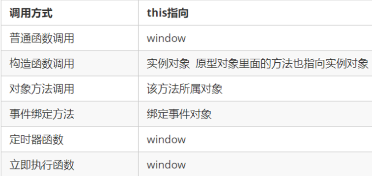
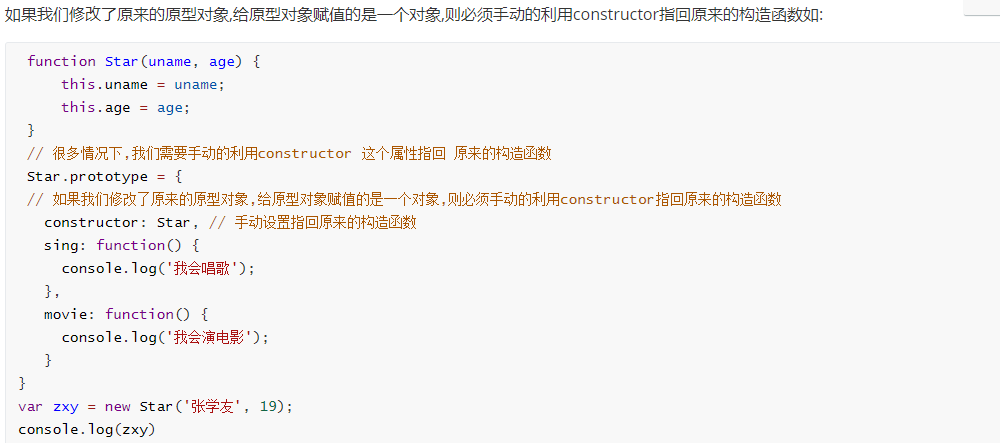
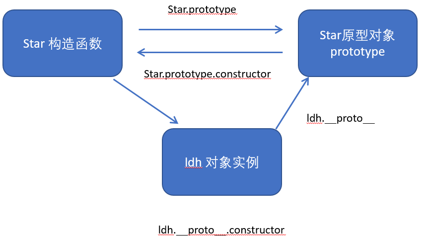

# 第五章：Javascript 高级

## 数据类型判断

### typeof

### instanceof

### constructor

### Object.prototype.toString.call

## this指向

>这些 this 的指向，是当我们调用函数的时候确定的。调用方式的不同决定了this 的指向不同，一般指向我们的调用者

1. 全局作用域或者普通函数中this指向全局对象window（注意定时器里面的this指向window）
2. 方法调用中，谁调用 this就指向谁
3. 构造函数中 this指向构造函数的实例

### call 方法

> **作用：**
>
> 1. 调用函数
> 2. 更改函数体中的this指向
> 3. **call 的继承性**

~~~javascript
// 语法格式：
函数名.call(对象, 实参1, 实参2... 实参n);
~~~

~~~javascript
let str = { name: '张学友' };
let star = { name: '刘德华' };

function fn (a, b, c) {
    console.log(this);
    console.log(a + b + c);
};

fn.call(star, 10, 20, 30);		// this是star，60
~~~

**call 应用场景：经常做继承**

~~~javascript
function Father (name, age) {
    this.uname = name;
    this,age = age;
    // this ==> window
};

function Son (name, age) {
    // this ==> window
    // call 将Father中的this指向Son
    Father.call(this, uname, age);
};

let son = new Son('张三', 18);

console.log(son);	// Son {uname: "张三"}
~~~

### apply 方法

> 作用：
>
> 1. 立刻调用函数
> 2. 更改函数体中的this指向
> 3. 参数以数组形式存放

**apply 应用场景：经常跟数组有关系**

~~~javascript
let arr = [10, 20, 30, 40, 50];
console.log(Math.max(10, 20, 30, 40, 50));

console.log(Math.max.apply(Array, arr));
~~~

### bind 方法

> **作用：**
>
> 1. 更改this指向
>
> 特点：
>
> 1. 不会立刻调用函数，会返回一个新函数
> 2. 能改变函数内部this 指向，返回的是原函数改变this之后产生的新函数
>
> **如果只是想改变 this 指向，并且不想调用这个函数的时候，可以使用bind**

~~~javascript
// 语法格式：
函数名.bind(对象)

~~~

**bind 应用场景：不调用函数,但是还想改变this指向**

## 严格模式

>严格模式对正常的 JavaScript 语义做了一些更改： 
>
>1. 消除了 Javascript 语法的一些不合理、不严谨之处，减少了一些怪异行为。
>2. 消除代码运行的一些不安全之处，保证代码运行的安全。
>3. 提高编译器效率，增加运行速度。
>4. 禁用了在 ECMAScript 的未来版本中可能会定义的一些语法，为未来新版本的 Javascript 做好铺垫。比如一些保留字如：class,enum,export, extends, import, super 不能做变量名

~~~javascript
// 1. 开启全局作用域下的严格模式
'use strict'

// 2. 开启局部作用域下的严格模式
function fn () {
    // 为函数开启严格模式
    'use strict'
};

(function () {
    // 为脚本开启严格模式
    'use strict'
});
~~~

### 开启严格模式的变化

~~~javascript
function fn () {
    'use strict';
    console.log(this);		// this不会指向window，而是指向 undefined
};
~~~

## 高阶函数

> **高阶函数：函数的参数是函数 或者 函数的返回值是函数**
>
> 高阶函数是对其他函数进行操作的函数，它接收函数作为参数或将函数作为返回值输出

### Array 方法

#### map()

>遍历源数据，返回修改过的数据

~~~javascript
let arr = [10, 20, 30, 40];

arr.map(function (item, index, arr) {
    return console.log(item);
});

// 结果为：10, 20, 30, 40
~~~

*item：必须。当前元素* 

*index：可选。当前元素索引值* 

*arr：可选。整个数组* 

#### every()

>判断每一项是否都满足条件，都满足返回 true，有一项不满足就返回 false

~~~javascript
let arr = [10, 20, 30, 40];

arr.every(function(item, index, arr) {
    return item > 70;
});

// 结果为：false
~~~

*item：必须。当前元素* 

*index：可选。当前元素索引值* 

*arr：可选。整个数组* 

#### some()

>判断每一项是否都满足条件，**只要有一项满足就返回 true**，都不满足就返回 false

~~~javascript
let arr = [10, 20, 30, 40];

arr.some(function(item, index, arr) {
    return item > 35;
});

// 结果为：true
~~~

*item：必须。当前元素* 

*index：可选。当前元素索引值* 

*arr：可选。整个数组* 

#### filter()

>创建一个新的数组，新数组中的元素是通过检查指定数组中符合条件的所有元素。
>
>**注意：**
>
>-  filter() 不会对空数组进行检测。
>
>-  filter() 不会改变原始数组。

~~~javascript
let arr = [10, 20, 30, 40];

arr.some(function(item, index, arr) {
    return item > 25;
});

// 结果为：
~~~

*item：必须。当前元素* 

*index：可选。当前元素索引值* 

*arr：可选。整个数组* 

#### sort()

>**对数组元素进行排序**
>
>> item1 - item2 是从小到大排序
>
>> item2 - item1 是从大到小排序

~~~javascript
let arr = [10, 30, 20, 40];

arr.sort(function(item1, item2) {
	// item1 - item2 是从小到大排序
    return item1 - item2;
});

// 结果为：[10, 20, 30, 40]
~~~

*item1：必须。当前元素* 

*item2：必须。下一个元素* 

#### reduce()

>**计算数组元素相加的总和** 

~~~js
arr.reduce(function(累加器, 当前项, 下标, 原数组) {
    return 累加器 + 当前项;
}, 累加器从多少开始加);
~~~

~~~javascript
let arr = [10, 20, 30, 40];

arr.reduce(function(total, item, index, arr) {
    return total + item;
}, 0);

// 结果为：100
~~~

*total：必需。初始值, 或者计算结束后的返回值。* 

*item：必需。当前元素* 

*index：可选。当前元素的索引值* 

*arr： 可选。当前元素所属的数组对象。* 

#### reduceRight()

> 从右到左。**计算数组元素相加的总和** 

## 闭包

> 闭包（closure）指有权访问另一个函数作用域中变量的函数。简单理解就是 ，一个作用域可以访问另外一个函数内部的局部变量。 

~~~javascript
function fn1 () {
    let num = 100;
    function fn2 () {
        console.log(num);
    }
    fn2();
}

fn1();	// fn1() 变量在fn1()中，fn1() 就是闭包函数
~~~

### 变量的作用域

变量根据作用域的不同分为两种：全局变量和局部变量。

1. 函数内部可以使用全局变量。

2. 函数外部不可以使用局部变量。
3. **当函数执行完毕，本作用域内的局部变量会销毁。**

### 立即执行函数

~~~javascript
// 语法格式
// ()();

(
	function (形参) {
        // 函数体
    }
)(实参);
~~~

### 闭包的作用

> 作用：延伸变量的作用范围。
>
> 简单理解：当函数执行完毕时，本作用域的局部变量不会销毁。

~~~javascript
var arr = [];

for (var i=0; i<10; i++) {
    // 产生一个小闭包
    (function(i) {
        arr[i] = function () {
            console.log(i);
        }
    })(i);
};

for (var j=0; j<arr.length; j++) {
    console.log(arr[j]());
};

/ 语法
(function(形参) {
    console.log();
})(实参);
~~~

模拟场景：列表绑定点击事件，获取点击第几项

> 模拟场景，不推荐列表点击事件这么写，仅用于需要留存变量时使用

~~~javascript
var lis = document.querySelectorAll('ul li');

for (var i=0; i<lis.length; i++) {
    (
        function (i) {
            lis[i].onclick = function () {
                console.log(i);
            }
        }
    )(i);
}
~~~

## 递归

> 如果一个函数在内部可以调用其本身，那么这个函数就是递归函数。
>
> **简单理解：函数内部自己调用自己，这个函数就是递归函数**
>
> `注意：递归函数的作用和循环效果一样，由于递归很容易发生“栈溢出”错误（stack overflow），所以必须要加退出条件return。`

### 递归求阶乘

> 阶乘：1 * 2 * 3 * 4 * ... * n

~~~javascript
function fn (n) {
    if (n == 1) {
        return 1;
    }
    return n * fn(n-1);
}

console.log(fn(4));

// 执行顺序：n * n-1 * n-2 * ... * 1
~~~

### 递归求斐波那契

>斐波那契（兔子序列）：前一项加后一项，循环计算

~~~javascript
function fn (n) {
    if (n == 1 || n == 2) {
        return 1;
    }
    return fn(n-1) + fn(n-2);
}

console.log(fn(8));

// 执行顺序：n + n-1 + n-2 + ... + 1
~~~

### 递归扁平化数组

> 思路，判断每一项是否为数组，是数组

~~~javascript
let arr = [1, [2, [3, [4, 5, [7, 8, 9]]]], 6];

let arrNew = [];

function fn(any) {
    for (let i=0; i<any.length; i++) {
        Array.isArray(any[i]) ? fn(any[i]) : arrNew.push(any[i]);
    };
};

fn(arr);
console.log(arrNew);
~~~

#### 扩展：flat 方法 扁平化数组

> flat() 方法创建一个新数组，其中所有子数组元素都以递归方式连接到该数组中，直到达到指定的深度为止。
>
> 返回值：一个新的数组，其中包含子数组元素。

~~~javascript
// 语法格式：
flat(depth);
// depth：指定嵌套数组结构应展平至多深的深度级别。默认为1

arr.flat(10000);
~~~

### 递归复制文件夹

> 模拟熊猫烧香病毒

#### MoveFile 方法

>将指定文件或文件夹从一个位置移动到另一个位置

~~~javascript
object.MoveFile(source, destination);
~~~

*object：必须。应为 FileSystemObject 的名称* 

*source：必须。需要移动的文件路径，source 参数的字符串只能在路径的最后成分中包含通配字符* 

*destination：必须。文件要移到的路径。 destination 参数不能包含通配字符* 

**注意：**

> 如果 *source* 包含了通配字符，或者 *destination* 以路径分隔符 () 结束，那么将假定 *destination* 指定了一个已有的文件夹，匹配的文件将移入其中。 否则，将假定 *destination* 为需要创建的目的文件名。 无论哪种情况，如果移动的是单个文件，将有三种可能：
>
> - 如果 *destination* 不存在，那么那么文件将被移动。 这是普通情况。
> - 如果 *destination* 是已经存在了的文件，那么将出错。
> - 如果 *destination* 是目录，那么也将出错。

**重要： **只有在操作系统支持时，才能通过这种方法在卷之间移动文件。

#### CopyFile 方法

>从一个位置向另一个位置移动一个或多个文件

~~~javascript
object.CopyFile ( source, destination, overwrite );
~~~

*object：必须。应为 FileSystemObject 的名称* 

*source：必须。指定文件字符串，可以包含通配字符来复制一个或多个文件* 

*destination：必须。目的字符串，文件将从 source 复制到这里。 不允许通配字符*

*overwrite：可选项。 Boolean 值，指明是否覆盖已有文件。 如果为 true ，则文件将被覆盖；如果为 false，则文件不会被覆盖。 默认的是 true。 注意，如果 destination 设置了只读属性，那么无论  overwrite 的值是什么，CopyFile 都会失败。*

#### MoveFolder 方法

>从一个位置向另一个位置移动一个或多个文件夹

~~~javascript
object.MoveFolder (source, destination);
~~~

*object：必须。 应为 FileSystemObject 的名称。*

*source：必须。 要移动的文件夹的路径。 source 参数的字符串只能在路径的最后成分中包含通配字符。*

*destination：必须。文件夹要移入的路径。 destination 参数不能包含通配字符。*

**注意：**

>如果 *source* 包含了通配字符，或者 *destination* 以路径分隔符 () 结束，那么将假定 *destination* 指定的是已经存在了的文件夹，匹配的文件将移入其中。 否则将假定 *destination* 是需要创建的目的文件夹的名称。 无论哪种情况，如果移动的是单个文件夹，将会有三种可能：
>
>- 如果 *destination* 不存在，那么文件夹将被移动。 这是普通情况。
>- 如果 *destination* 是已有的文件，那么将出错。
>- 如果 *destination* 是目录，那么也将出错。

如果 source 中使用的通配字符无法匹配任何文件夹，那么也将出错。 **MoveFolder** 方法在遇到第一个错误时终止。 出错后不会试图回滚出错前所做的修改。

**重要 ：**只有在操作系统支持时，才能通过这个方法在卷之间移动文件夹。

## 面向对象编程介绍

> 两大编程思路：
>
> - **面向过程 POP**（Process-oriented programming）
>   - 面向过程 就是分析出解决问题所需要的的**步骤**，然后用函数把这些步骤一步一步实现，使用的时候再一个一个的依次**调用**。
> - **面向对象 OOP**（Object Oriented Programming）
>   - 面向对象 是**把事务分解成一个个对象，然后由对象之间分工与合作。**
>   - 面向对象是以对象来划分问题，而不是步骤。
>     - 简单理解：先找出对象，然后写出这些对象的功能。
>   - 在面向对象程序开发思想中，每一个对象都是功能中心，具有明确分工。
>   - **优点：**
>     - 面向对象编程具有灵活、代码可复用、容易维护和开发的优点，更适合多人合作的大型软件项目。
>   - **特性：**
>     - 封装性
>     - 继承性
>     - 多态性

### 面向过程和面向对象的对比

面向过程：

- 优点：性能比面向对象高，适合跟硬件联系很紧密的东西，例如单片机就采用的面向过程编程。 

- 缺点：没有面向对象易维护、易复用、易扩展。

面向对象：

- 优点：易维护、易复用、易扩展，由于面向对象有封装、继承、多态的特性，可以设计出低耦合的系统，使系统更灵活、更易于维护。
- 缺点：性能比面向过程低。

## 构造函数创建对象

### 创建对象的三种方式

~~~javascript
// 字面量创建对象
var obj = {};

// new Object 创建对象
var obj = new Obgect();

// 自定义函数(构造函数)创建对象
function Star(name, age) {
    this.name = name;
    this.age = age;
    // 构造方法
    this.sing = function () {
        console.log('唱歌');
    }
}

var ldh = new Star('刘德华', 18);
console.log(ldh.sing);	// 唱歌
~~~

> this 指向对象实例 刘德华

### 原型对象

> 作用：减少内层占用

~~~javascript
// 构造函数创建对象
function Star(name, age) {
    this.name = name;
    this.age = age;
}

// 实例调用构造函数原型方法
Star.prototype.sing = function () {
    console.log("会唱歌");
}

ldh.sing();	// 会唱歌
~~~

### constructor 构造函数

>对象原型和构造函数原型对象里面都有一个属性 constructor，称为构造函数，它值回构造函数本身。

~~~javascript
Star.prototype.constructor

/* 输出结果：
	function Star(name, age) {
        this.name = name;
        this.age = age;
    }
*/
~~~

简化操作

~~~javascript
// 1. option: 使用对象接收，这里只需要写一个形参接收
function Star (option) {
    // 2. 这里把this指向改为option
    Object.assign(this, option);
}

List.prototype = {
    // 
    constructor: List,
    
    // 构造函数中的 autoPlay 方法
    autoPlay: function () {
        //3. this指向为option对象，所以直接点键值就可以访问
        console.log(this.img);
    }
    
    // 构造函数中的 sing 方法
    sing: function () {
        console.log("会唱歌");
    }
}

var list = new Star({
    // 1. 使用对象接收，只需要写一个实参
    img: document.querySelectorAll("img"),
    index: 0,
});
~~~

## 构造函数实例和原型对象三角关系

1. 构造函数的prototype属性指向了构造函数原型对象
2. 实例对象是由构造函数创建的,实例对象的__proto__属性指向了构造函数的原型对象
3. 构造函数的原型对象的constructor属性指向了构造函数,实例对象的原型的constructor属性也指向了构造函数

## Object.assign(this, option);

~~~javascript
Object.assign(目标参数, 源对象1, 源对象2);
// 源对象可以写一个，也可以写多个
~~~

> **Object.assign 方法用于对象的合并**，将源对象（source）的所有可枚举属性，复制到目标对象（target）。
>
> **注意：** 
>
> - 同名属性覆盖
>
>   - 如果目标对象与源对象有同名属性，或多个源对象有同名属性，则后面的属性会覆盖前面的属性
>
> - 浅拷贝
>
>   - Object.assign 方法实行的是浅拷贝，而不是深拷贝。也就是说，如果源对象某个属性的值是对象，那么目标对象拷贝得到的是这个对象的引用。
>
> - 数组的处理
>
>   - Object.assign 可以用来处理数组，但是会把数组视为对象。
>
>   - ~~~javascript
>     Object.assign([1, 2, 3], [4, 5]);
>     // [4, 5, 3]
>     // Object.assign把数组视为属性名为 0、1、2 的对象，因此源数组的 0 号属性4覆盖了目标数组的 0 号属性1
>     ~~~
>
> - 取值函数的处理
>
>   - Object.assign 只能进行值的复制，如果要复制的值是一个取值函数，那么将求值后再复制
>
>   - ~~~javascript
>     const source = {
>       get foo() { return 1 }
>     };
>     const target = {};
>     
>     Object.assign(target, source)
>     // { foo: 1 }
>     ~~~
>
> 更多解释：
>
> - 简书：https://www.jianshu.com/p/d5f572dd3776
> - CSDN：https://blog.csdn.net/qq_44166697/article/details/107792089

## 原型对象：轮播图效果

~~~javascript
function Slide(option) {
	Object.assign(this, option);
}

Slide.prototype = {
    constructor: Slide,
    autoPlay: function () {
		setInterval(function () {
			this.index = this.index == this.data.length - 1 ? 0 : this.index+1;
            this.img.src = this.data[this.index];
        }.bind(this), 1000);
    },
}

var slide = new Slide({
	data: ['./img/1.jpg', './img/2.jpg', './img/3.jpg'],
    img: document.querySelector("img"),
    index: 0,
});

slide.autoPlay();
~~~

## 原型链

>对象实例上面查找属性或者方法时，去对象实例上找，找不到时就到 Star原型上的 prototype 上找，再找不到就到 Object 上的 prototype 上找
>
>原型链：对象实例.prototype  =>  对象.prototype  =>  Object.prototype

~~~javascript
// 创建构造函数
function Star (uname, age) {
    // this.uname = name;
    this.age = age;
    this.money = function () {
        console.log(200);
    }
}

Star.prototype.money = finction () {
    console.log(300, "Star.prototype");
}
Object.prototype.money = finction () {
    console.log(10000, "Object.prototype");
}
Star.prototype.uname = '李四';

// 根据构造函数创建实例对象
var zs = new Star("张三", 18);

console.log(zs.money());	// 200
console.log(zs.uname);	// 李四
~~~

## 继承

> 子承父业
>
> 作用：代码复用

### 继承的实现方式

#### 构造函数

> 只能继承属性，无法继承方法

~~~javascript
// 1. 创建父构造函数
function Father(uname, age) {
    this.uname = uname;
    this.age = age;
}

Father.prototype.sing() = function () {
    console.log('唱歌');
}

// 2. 创建子构造函数
function Son(uname, age) {
    Father.call(this,uname,age);
}

var son = new Son('儿子', 19);

console.log(son);	// 能访问 uname、age 属性，无法访问方法
~~~

#### 原型

>只能继承属性，也能继承继承方法

~~~javascript
// 1. 创建父构造函数
function Father(uname, age) {
    this.uname = uname;
    this.age = age;
}

Father.prototype.sing = function () {
    console.log('唱歌');
}

// 2. 创建子构造函数
function Son(uname, age) {
    Father.call(this, uname, age);
}

// 原型继承方法
Son.prototype = Father.prototype;

var son = new Son('儿子', 19);
console.log(son);	// 能访问 uname、age 属性，也能访问方法
~~~

### Object.defineProperty

>设置或修改对象中的属性

~~~javascript
// 语法格式：
Object.defineProperty(obj, prop, descriptor);

obj: 必须。目标对象
prop：必须。需定义或修改的属性的名字
descriptor：必须。目标属性所拥有的特性
~~~

~~~javascript
Object.defineProperty(o, 'name', {
	value: '张三',
    // 配置是否可修改属性的值，默认是 false
    writable: true,
    // 配置对象是否可遍历，默认是 false
    enumerable: true,
    // 目标属性是否可以删除 name 属性，默认是 false
    configurable: true,
});
~~~

#### get 方法

> 访问属性值

~~~javascript
Object.defineProperty(o, 'age', {
    get: function () {
        return 17;
    }
});

console.log(o,age);		// 17
~~~

#### set 方法

> 赋值时会自动调用 set 方法
>
> enumerable:true  configurable:true  在set中不能用

~~~javascript
let InvaValue;
Object.definProperty(o, 'age', {
    set: function (value) {
        InvaValue = value;
        console.log('set方法执行了');
    }
});

o.age = 20;		// set方法执行了
console.log(o.age);		// 20   value 就是修改的值
~~~

**==访问使用get，赋值使用set==**

## 案例：面向对象创建选项卡

> html 结构

~~~html

    <ul class="list">
        <!-- <li index="0" class="selected">红色</li>
        <li index="1">蓝色</li>
        <li index="2">绿色</li> -->
    </ul>
    

        <!-- 
红色

        
蓝色

        
绿色
 -->
    

~~~

> JavaScript 文件

~~~javascript
let data = [
    {
        title: '红色',
        color: '#f00'
    },
    {
        title: '蓝色',
        color: '#00f'
    },
    {
        title: '绿色',
        color: '#0f0'
    },
    {
        title: '青色',
        color: '#0ff'
    },
    {
        title: '黄色',
        color: '#ff0'
    },
];

// 1. 创建构造函数
function List(option) {
    Object.assign(this, option);
}

// 3. 共用方法
List.prototype = {
    constructor: List,

    // 初始化方法
    init: function () {
        list.render();
        list.bindEvent();
    },

    // 渲染页面
    render: function () {
        var that = this;
        this.list.innerHTML = this.data.map(function (item, index) {
            return `<li index="${index}" ${index == that.idx ? `style="background: ${item.color};"` : ''} >${item.title}</li>`;
        }).join('');
        this.item.innerHTML = this.data.map(function (item, index) {
            return `
${item.title}
`;
        }).join('');
    },

    // 点击事件
    bindEvent: function () {
        var that = this;
        this.list.addEventListener('click', function (e = event || window.event) {

            if (e.target.nodeName == "LI") {

                // 清除高亮
                // document.querySelector('.selected').classList.remove('selected');
                this.children[that.idx].style.background = '';

                // 获取当前下标
                let index = +e.target.getAttribute('index');
                that.idx = index;

                // 添加高亮
                // this.children[index].classList.add('selected');
                this.children[index].style.background = that.data[index].color;

                // 清除选项卡
                document.querySelector('.active').classList.remove('active');
                // 显示当前选项卡
                that.item.children[index].classList.add('active');

            }

        })
    }
}

// 2. 创建实例对象
var list = new List({
    list: document.querySelector('.list'),
    item: document.querySelector('.content'),
    data: data,
    idx: 0,
});

// 调用初始化方法
list.init();

~~~

## ES6中的类和对象

> 事务分为 具体（特指）事务 和 抽象（泛指）事务。
>
> 面向对象的思维特点：
>
> 1. 抽象对象共用的属性和行为组织（封装）成一个类（模板）。
> 2. 对类进行实例化，获取类的对象。
>
> ==面向对象编程，我们考虑的是有哪些对象，按照面向对象的思维特点，不断的创建对象，使用对象，指挥对象做事。==

### 对象

> JavaScript 中，对象是一组无序的相关属性和方法的集合，所有的事务都是对象，例如：字符串、数值、数组、函数 等。
>
> 对象是由属性和方法组成：
>
> 属性：事物的**特征**，在对象中用属性来表示（常用名词）
>
> 方法：事物的**行为**，在对象中用**方法**来表示（常用动词）。

### 类 class

> ES6 新增了类的概念，可以使用 class 关键字声明一个类，之后以这个类实例化对象。
>
> **类**抽象了对象的公共部分，它泛指某一大类（class）
>
> **对象**是**特指**某一个，通过类实例化一个具体的对象。

#### 创建类

> **通过class 关键字创建类，类名首字母大写**
>
> ==类必须使用 new 实例化对象==
>
> ==ES6 中没有变量提升，所以必须要先定义类，才能通过类实例化对象。==

~~~javascript
// 语法格式：
class Name {
    // calss body
}

/ 创建实例：
var xx = new Name();
~~~

#### 类 constraint 构造函数

> constructor() 方法 是类的构造函数（默认方法），**用于传递参数，返回实例对象** 
>
> - 通过 new 命令生成对象实例时，自动调用该方法。
> - **如果没有显示定义，类内部会自动给我们创建一个 constructor()** 

~~~javascript
// 语法格式：
class Star {
    constructor(uname, age) {
        this.uname = uname;
        this.age = age;
    }
}

// 利用类创建对象 new
new bz = new Star('播仔', 18);

// 打印类
console.log(bz);	// Star {uname: "播仔", age: 18}

// 打印 uname、age
console.log(bz.uname);
console.log(bz.age);
~~~

#### 类添加方法

> 语法格式：
>
> - 创建类 类名后面不加小括号；生成实例。
> - 类名后加小括号
> - 构造函数不需要加 function
> - 类中的方法都是挂载到 Star.prototype 上的

~~~javascript
// 语法格式：
class Star {
    // 类的共有属性放在 constructor 里面
    constructor (uname) {
        this.uname = uname;
    };
    // 共有方法
    sing (song) {
        console.log(`${this.uname} ：${song}`);
    }
}

// 利用类创建对象 new
new bz = new Star('播仔');
new hz = new Star('猴子');

// 打印
bz.sing('追光者');	// 播仔：追光者
hz.sing('晚婚');	// 猴子：晚婚
~~~

### 类的注意事项

==类里的共有属性和方法一定要加 this 使用。==

==constructor 中的 this 指向的是创建的实例对象，方法中的 this 指向的是这个方法的调用者==

~~~javascript
class Star {
    constructor(option) {
        Object.assign(this, option);
        // 公有方法要加 this
        this.sing();
        // 获取按钮，点击触发 sing 方法
        this.btn = document.querySelector('button');
        // 方法不加 括号，不然会直接调用
        this.btn.onclick = this.sing;
    }
    sing() {
        console.log(this.uname);
    }
}

var star = new Star ({
    uname: '刘德华',
    age: '18',
});
~~~

## 类和继承

### 继承 extends

> 子类可以继承父类的属性和方法。

~~~javascript
// 语法格式：
calss Father {
    constructor() {
        
    }
    money() {
        console.log(100);
    }
}

// 子类：继承父类的属性和方法
class Son extends Father {
	constructor() {
        
    }
}

// 利用类创建对象 new
var son = new son();

// 打印子类，继承父类的属性和方法
son.money();	// 100
~~~

### super 关键字

>super 关键字 用于访问和调用对象父类上的函数。可以调用父类的构造函数，也可以调用父类的普通函数。

~~~javascript
// 语法格式：
class Father {
    constructor(x, y) {
        this.x = x;
        this.y = y;
    }
    sum() {
        console.log(this.x + this.y);
    }
    
    // 子类
    class Son extends Father {
        constructor(x, y) {
            // 调用父类中的构造函数
            super(x, y);
        }
    }
}

// 利用类创建对象 new
let son = new Son(1,2);

// 打印
son.sum();	// 3
~~~

#### super 查找原则

> 继承中，如果实例化子类输出一个方法，先看子类有没有这个方法，如果有就先执行子类的方法，如果没有，则找父类中有没有这个方法，如果有就执行父类的这个方法。
>
> **简单理解：super 取就近原则**

~~~javascript
class Father {
    // 
    say () {
        return '我是爸爸';
    }
}

class Son extends Father {
    say () {
        // 调用父类方法
        console.log(super.say() + '的儿子');
    }
}

// 创建实例化对象
let son = new Son();

// 打印子类方法
son.say();		// 我是爸爸的儿子
~~~

#### super 调用规则

> **子类在构造函数中使用 super，必须放到 this 前**（必须先调用父类的构造方法，再使用子类的构造方法)

~~~javascript
// 父类
class Father {
    constructor (x, y) {
        this.x = x;
        this.y = y;
    }
    // 求和运算方法
    sum () {
        console.log(this.x + this.y);
    }
}

// 子类
class Son extends Father {
    constructor (x, y) {
        // super 必须放在 this 前
        super (x, y);
        this.x = x;
        this.y = y;
    }
    
    // 减法运算方法
    sub () {
        console.log(this.x - this.y);
    }
}

// 创建实例对象
let son = new Son(3,1);

// 打印方法
son.sum();	// 4
son.sub();	// 2
~~~

### 静态属性、方法

> 通过 实例对象.属性名 来定义静态属性
>
> 通过 实例对象.方法 来定义静态方法

#### 面向对象添加静态属性、方法

~~~javascript
// 语法格式：
实例对象.属性名
实例对象.方法名

function Star(uname) {
    // 添加实例属性
    this.uname = uname;
}

// 添加实例方法
star.prototype.sing = function () {
    console.log('唱歌');
}

// 添加静态属性
Star.age = 10;

// 添加静态方法
Star.play = function () {
    console.log('玩耍');
}

var star = new Star('刘德华');
~~~

#### 类添加静态属性、方法

~~~javascript
class Star {
    constructor (uname) {
    	// 添加实例属性
        this.uname = uname;
    }
    
    // 添加实例方法
    sing () {
        console.log('唱歌');
    }
    
    // 静态属性
    static.age = 20;
	static age = 18;

	// es11新语法：静态成员使用 #修饰
    #sex
    
	// 静态方法
	static play () {
        console.log('玩耍');
    }
	
}

// 创建实例对象
var star = new Star('刘德华');

/ 静态访问，不需要创建实例，直接使用 类.属性
Star.age
~~~

## 正则表达式

> **正则表达式（ Regular Expression ）是用于匹配字符串中字符组合的模式。在JavaScript中，正则表达式也是对象。**
>
> 正则表通常被用来检索、替换那些符合某个模式（规则）的文本，例如验证表单：用户名表单只能输入英文字母、数字或者下划线， 昵称输入框中可以输入中文(匹配)。此外，正则表达式还常用于过滤掉页面内容中的一些敏感词(替换)，或从字符串中获取我们想要的特定部分(提取)等 。

### 正则表达式的特点

> 1. 灵活性、逻辑性和功能性非常的强。
> 2. 可以迅速地用极简单的方式达到字符串的复杂控制。
> 3. 实际开发,一般都是直接复制写好的正则表达式。但是要求会使用正则表达式并且根据实际情况修改正则表达式。比如用户名:  /^[a-z0-9_-]{3,16}$/

### 正则表达式的创两种创建方式

> / / 中的数据，不论数据类型，都不要加引号

~~~javascript
// 语法格式：
new RegExp(/正则表达式规则/);

// 利用 RegExp 对象来创建正则表达式
var reg = new RegExp(/abc/);

// 利用字面量的方式 创建正则表达式
var reg1 = /abc/;
~~~

### 校验数据

> 校验数据时，/ / 中的数据要加引号
>
> test() 方法的返回值是 true || false

~~~javascript
// 语法格式：
正则变量名.test('要检索的字符串');

console.log( reg.test('bca') );
~~~

### 正则表达式的特殊符号

#### 边界符

>正则表达式中的边界符（位置符）用来提示字符所处的位置，主要有两个字符

| 边界符 | 说明                           |
| :----: | :----------------------------- |
|   ^    | 表示匹配行首的文本（以谁开始） |
|   $    | 表示匹配行尾的文本（以谁结束） |

~~~javascript
//边界符
var reg = /^abc/;
console.log( reg.test('abcssasdasda') );	// true
console.log( reg.test('asbcsasdasda') );	// false

var reg1 = /abc$/;
console.log( reg1.test('ssasabc') );	// true
console.log( reg1.test('ssabcsa') );	// false

// 以abc开始，以abc结束
var reg2 = /^abc$/;
console.log( reg1.test('abc') );	// true
console.log( reg1.test('abcabc') );	// false
~~~

#### 字符类

> 只要包含 [] 中的内容就为 true
>
> ==如果括号里有 ^ 表示取反的意思，和边界符不一样==

|  字符类  |              说明               |
| :------: | :-----------------------------: |
|    []    |  匹配包含 [] 中的内容就为 true  |
|  [a-z]   |       匹配 a-z 之间的字母       |
| ^[a-z]$  |   匹配 a-z 之间的其中一个字母   |
| [a-zA-Z] | 匹配 a-z A-Z 之间的其中一个字母 |
|  [^a-z]  |    不允许出现 a-z 其中的字母    |

~~~javascript
// 匹配 只要包含 abc 中的内容就为 true
var reg = /[abc]/;
console.log( reg.test('a') );	// true

// 匹配 a || b || c，其都为 false
var reg = /^[abc]$/;
console.log( reg.test('ab') );	// false
console.log( reg.test('abc') );	// false
~~~

#### 量词符

>用来设定某个模式出现的次数

| 量词符 | 说明                                    |
| :----: | --------------------------------------- |
|   *    | 重复0次 或 更多次                       |
|   +    | 重复一次 或 更多次                      |
|   ?    | 多个字符 重复0次 或 1次（单个字符无效） |
|  {n}   | 重复 n 次                               |
|  {n,}  | 重复 n次 或 更多次                      |
| {n, m} | 重复 n 到 m次                           |

#### 预定义类

>预定义类指的是某些常见模式的简写方式

| 预定类 | 说明                                                         |
| :----: | :----------------------------------------------------------- |
|   \d   | 匹配0~9之间任意数字，相当于 `[0, 9]`                         |
|   \D   | 匹配0~9以外的字符，相当于 `[^0, 9]`                          |
|   \w   | 匹配任意字母、数字、下划线以外的字符，相当于 `[A-Za-z0-9_]`  |
|   \W   | 除所有字母、数字和下划线以外的字符，相当于 `[^A-Za-z0-9_]`   |
|   \s   | 匹配空格（包括换行符、制表符、空格符等），相当于 `[\t\r\n\v\f]` |
|   \S   | 匹配非空格的字符，相当于 `[^\t\r\n\v\f]`                     |

### 括号总结

1. 大括号 量词符. 里面表示重复次数
2. 中括号 字符集合。匹配方括号中的任意字符
3. 小括号表示优先级

~~~javascript
//边界符
var reg = /^abc/;
console.log( reg.test('abcssasdasda') );	// true
console.log( reg.test('asbcsasdasda') );	// false

var reg1 = /abc$/;
console.log( reg1.test('ssasabc') );	// true
console.log( reg1.test('ssabcsa') );	// false

// 以abc开始，以abc结束
var reg2 = /^abc$/;
console.log( reg1.test('abc') );	// true
console.log( reg1.test('abcabc') );	// false
~~~

### 正则替换 replace

>replace() 方法可以实现替换字符串操作，用来替换的参数可以是一个字符串或是一个正则表达式。

~~~javascript

~~~

待补充

## 面向对象案例

待补充

## 常量 const

>使用 const 声明引用类型时，不允许进行赋值，但可以通过指针进行改值。

~~~javascript
// 使用 const 声明引用类型
const arr = [];

arr[0] = 10;	// [10]
arr = [20];		// error：不允许赋值，但可以通过指针进行改值
~~~

## 解构赋值

> ES6 新增一种方式——解构赋值

### 数组解构

> 例如：**把数组 [1, 2, 3] 中的元素分别赋值给 a、b 和 c，传统的做法是单独声明变量和赋值** 

~~~JavaScript
// 传统方式
var arr = [1, 2, 3];
var a = arr[0];
var b = arr[1];
var c = arr[2];

// 解构赋值
[a, b, c] = [1, 2, 3];
~~~

<!-- 传统方式要完成此功能要麻烦一点 -->

使用解构赋值时，会将 "=" 右侧 "[]" 中的元素依次赋值给左侧 "[]" 中的变量

- 当左侧变量的数量小于右侧元素个数时，则忽略多余的元素

  ~~~JavaScript
  [a, b] = [1, 2, 3];		// [1, 2]
  ~~~

- 当左侧变量的数量大于右侧元素个数时，则多余的变量会被初始化为 undefined

  ~~~JavaScript
  [a, b, c, d] = [1, 2, 3];	// [1, 2s, 3, undefined]
  ~~~

解构赋值 右侧的内容还可以是一个变量名，或是通过解构赋值完成两个变量数值的交换

~~~javascript
var arr = [1, 2, 3];
[a, b] = arr;			// [1, 2]: 左边值少，舍弃 3
console.log(a + '-' + b);	// 	1-2

var n1 = 4, n2 = 8;
[n1, n2] = [n2, n1];	//可以是变量
console.log(n1 + '-' + n2);		// 8-4
~~~

### 对象解构

>待补充

~~~javascript
var obj = {
    name: '张三',
    age: 17,
    love: '干饭',
}

var {name, age, love} = obj;

console.log(name);	// 张三
console.log(age);	// 17
console.log(love);	// 干饭
~~~

## 箭头函数

~~~javascript
// 语法格式：
var fn = (属性1, 属性2) => {
    return 属性1 + 属性2;
}

// 属性写在括号里
var add = (num1, num2) => {
    return num1 + num2;
}
console.log( add(7) );	// 70

// 简写方式：如果函数体内只有一行代码，可以省略花括号
sum = (a, b) => a + b;

sum(1, 2);	// 3
~~~

**注意：**

> ==**箭头函数中没有 arguments**==，但可以使用 **展开运算符** 来访问所有的实参
>
> - 展开运算符的变量名 一般使用 arguments 的简写(args) 来声明
>
> *arguments 是伪数组，可以遍历，可以通过下标访问数据*
>
> **但是通过箭头函数给伪数组设置变量名，可以让他变成正常的数组**

~~~javascript
var fn = (...args) => {
    console.log(args);	// [10, 20, 30, 40, '张三'];
}

fn(10, 20, 30, 40, '张三');
~~~

**箭头函数的this指向问题**

- ==箭头函数中没有自己的 this==，所以指向 window

  ~~~javascript
  var fn = () => {
      console.log(this);	// window
  }
  
  fn.call(this);
  ~~~

- ==箭头函数中没有自己的 this==，不能创建实例

  ~~~javascript
  var Star = (name) => {
      this.name = name;
      console.log(this);	// Star is not a constructor
  }
  
  var star = new Star('张三');
  ~~~

  - 想要创建自己的实例，只能通过 new 的形式创建对象

    ~~~javascript
    var Star = (option) => {
        Object.assign(this, option);
    }
    
    var star = new Star({
        uname: '张三',
        age: 17,
    });
    
    console.log(star.age);	// 17
    ~~~

## 展开运算符

> 扩展运算符可以将数组或者对象转为用逗号分隔的参数序列
>
> ~~~javascript
> // 语法格式：
> ... 变量名
> ~~~

扩展运算符可以应用于合并数组

~~~javascript
let arr1 = [1, 2, 3];
let arr2 = [2, 3, 4];
// 方法一：
let arr3 = [...arr1, ...arr2];
// 方法二：
let arr4 = arr1.push(...arr2);
~~~

**将类数组或可遍历对象转换为真正的数组**

~~~javascript
let lis = document.querySelectorAll('ul li');
lis = [...lis];
~~~

## 封装DOM

> 更方便使用，不需要一直写 document.querySelector

~~~html
<ul class="box">
    <li>列表1</li>
    <li>列表2</li>
</ul>

~~~

## 严格判断数据类型

>全等无法判断 NaN
>NaN === NaN	=>	false

~~~javascript
Object.is(NaN, NaN);	// true
~~~

## 内置对象方法 扩展

### Array.from()

### 实例方法：find()

> 根据条件筛选数据

~~~javascript
// 语法格式：
数组.find(回调函数);
~~~

~~~javascript
var arr = [
    {name:'张三', age: 17, score: 90},
    {name:'李四', age: 17, score: 95},
    {name:'王五', age: 17, score: 100},
];

~~~

### 实例方法：findIndex()

>查找数组中**第一个满足条件项的下标** 

~~~javascript
// 语法格式：
数组.find(回调函数);
~~~

~~~javascript
var arr = [
    {name:'张三', age: 17, score: 90},
    {name:'李四', age: 17, score: 95},
    {name:'王五', age: 17, score: 100},
];

var r = arr.findIndex(item => item.score == 95);	// 1
~~~

### 实例方法：includes()

> 查找数组是否存在某一项

~~~javascript
var arr = [10, 20, 30, 40];

console.log(arr.includes(40));	// true
~~~

#### indexOf() 和 includes() 的区别

> 相同点：查找数组中是否存在某一项
>
> 不同点：
>
> - **indexOf()：** 
>
>   1. **返回值是 当前项的下标，找不到返回 -1**
>
>      ~~~javascript
>      console.log(arr.indexOf(40)); 	// 3
>      ~~~
>
>   2. **如果数组中有 NaN，indexOf() 无法查找，会返回 -1**
>
>      ~~~javascript
>      var arr = [10, 20, NaN];
>      
>      console.log(arr.indexOf(NaN));	// -1
>      ~~~
>
> - **includes()** 
>
>   1. **返回值是 布尔值，true || false** 
>
>      ~~~javascript
>      console.log(arr.includes(40));	// true
>      ~~~
>
>   2. **如果数组中有 NaN，includes() 会进行查找** 
>
>      ~~~javascript
>      var arr = [10, 20, NaN];
>      
>      console.log(arr.includes(NaN));	// true
>      ~~~

### startsWith 方法 和 endWith 方法

> **作用：查找字符串中是否以 ... 开始，或者以 ... 结束**
>
> **返回值：布尔类型**（true 包含  ||  false 不包含）

#### startsWith ()

> 以 ... 开始

~~~javascript
var str = 'hello wold';

console.log(str.startsWith('h'));	// true
~~~

#### endWith ()

> 以 ... 结束

~~~javascript
var str = 'hello wold';

console.log(str.startsWith('ld'));	// true
~~~

### repeat() 方法

> 作用：将字符串重复指定次数，返回一个新字符串

~~~javascript
// 语法格式：
字符串.repeat(次数)；

var str = '张三';

console.log(str.repeat(3));		// 张三张三张三
~~~

### Set() 方法

#### Set() 去重

>作用：实现数组去重
>
>方法中的 **set 属性：新数组中的长度** 

~~~javascript
var arr = [10, 10, 20, 20, 30];

var newArr = new Set(arr);

console.log(newArr);	// {10, 20, 30}
console.log(newArr.size);	// 3
~~~

#### Set() 添加数据

> 可以采用链式编程

~~~javascript
var set = new Set();

Set.add(100)
   .add('李四');
~~~

#### Set() 查找是否包含

~~~javascript
var set = new Set();

set.has(100);
~~~

#### Set() 删除数据

~~~javascript
var set = new Set();

set.delect('李四')；
~~~

#### Set() 清除所有数据

~~~javascript
var set = new Set();

Set.clear();
~~~

==**注意：**set() 方法，得到的数组是一个伪数组== 

> 不可以for循环遍历。不可以使用 数组的方法，需要使用 展开运算符 或 Array.from() 进行转数组
>
> ==虽然 set()得到的是一个伪数组，但是可以使用 **for in **进行遍历==

### Object.keys() 获取所有属性

~~~js
# 语法格式：
Object.keys(obj);

var obj = {name: '张三', age: 18};
Object.keys(obj);	// ["name", "age"]
~~~

### Object.entries()

~~~js
# 语法格式
Object.entries(obj);

var obj = {name: '张三', age: 18};
Object.entries(obj);	// [ ["name", "张三"], ["age", 18] ]
~~~

### Object.fromEntries()

~~~js
# 语法格式
Object.fromEntries(obj);

var arr = [ ["name", "张三"], ["age", 18] ];
Object.fromEntries(arr);	// {name: '张三', age: 18}
~~~

## 浅拷贝

> 将引用类型的**指针**拷贝给新对象
>
> **注意：** 
>
> **由于拷贝的是同一个指针，指针指向堆内存中同一块空间，所以修改数据时会相互影响**

~~~javascript
var o = {
    name: '张三',
}

var obj = o;

obj.name = '李四';

console.log(o);		// 李四
~~~

## 深拷贝

>将引用类型**各项属性的值**拷贝给新对象

### 方式一：手动拷贝

>手动拷贝要一个属性一个属性进行拷贝

~~~javascript
var o = {
    name: '张三',
    info: {
        age: 17,
    }
}

var r = {
    name: o.name,
    info: o.info() {
    	age: o.info.age,
	}
}
~~~

### 方式二：Object.assign();

> **只能实现一层的深拷贝**
>
> **重复的属性，后面会覆盖前面的属性**

~~~javascript
// 语法格式：
Object.assign(目标对象, 待拷贝的对象1, 待拷贝的对象2, 待拷贝的对象3, );
~~~

~~~javascript
待补充
~~~

### 方式三：JSON做字符串转换

>只有可以转成JSON格式的对象才可以这样用，像function没办法转成 JSON

~~~javascript
var o = {
    name: '张三',
    info: {
        age: 17,
    }
}

var r = JSON.parse(JSON.stringify(o));
~~~

### 方式四：slice()

>slice() 截取也不会影响，所以可以使用 slice(0) 从第零项截取到最后一项，实现深拷贝。

~~~javascript
var arr = [10, 20, 30];
var r = arr.slice(0);

r[0] = 100;

console.log(arr);	// [10, 20, 30]
~~~

### 方式五：递归拷贝

>待补充

~~~javascript
var o = {
    name: '张三',
    info: {
        age: 17,
    },
    arr: [10, 20],
    fn () {
        console.log(100);
    }
}

function deepCopy(obj) {
    // 1. 如果当前类型是不是基本类型，是就 return，不是就继续执行
    if (typeof obj !== 'object' || typeof obj == null) {
        return;
    }

    // 2. 判断当前是对象还是数组，字面量定义变量，用于创建储存器
    let result = obj.__proto__.constructor.name == "Object" ? {} : [];

    // 3. 遍历数组 / 对象
    for (const key in obj) {
        // 4. 如果当前项是object，就重新调用拷贝函数，遍历当前项，如果不是 object，则递归到新对象
        result[key] = typeof obj[key] == "object" ? deepCopy(obj[key]) : obj[key];
    }

    // 5. 返回新对象
    return result;
}

let r = deepCopy(o);
console.log(r);
~~~

